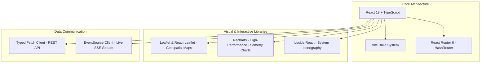
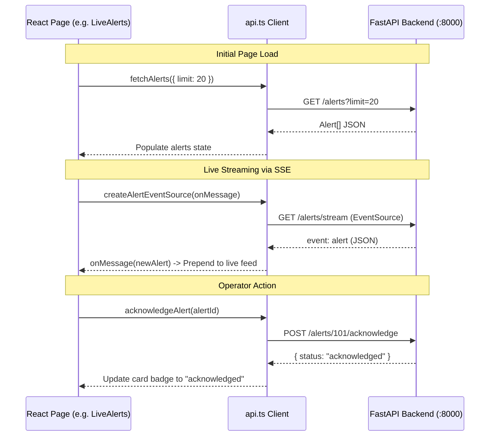

# 🎨 SkyguardAI - Frontend & UI Architecture Documentation
### Complete Technical Structure, Page Breakdown & Design System

---

## 1. Overview & Technology Stack

The SkyguardAI frontend is an operational dashboard designed for mission-critical atmospheric sensor monitoring, real-time anomaly triage, timeseries exploration, and explainable AI diagnostics.



### Key Libraries & Dependencies
- **UI Framework**: React 19 (`react`, `react-dom`) with TypeScript
- **Routing**: `react-router-dom` v6 (`HashRouter` for reliable static and subpath routing)
- **Geospatial Mapping**: `leaflet` & `react-leaflet` with custom pulsating SVG/CSS markers
- **Timeseries Visualization**: `recharts` for responsive multi-area gradients, dual axes, and reference zones
- **Iconography**: `lucide-react`
- **Design System**: Vanilla CSS Glassmorphism with modern CSS variables, dark-mode gradients, and micro-interactions

---

## 2. Directory & Component Hierarchy

```text
frontend/
├── index.html                 # Single page application entrypoint
├── package.json               # Dependencies & scripts
├── vite.config.ts             # Vite bundler configuration
├── src/
│   ├── main.tsx               # React DOM bootstrap
│   ├── App.tsx                # Top-level Router & layout container
│   ├── index.css              # Global design system, glassmorphism & tokens
│   ├── config.ts              # API base URL configuration (VITE_API_URL fallback)
│   ├── api.ts                 # Typed HTTP REST & SSE EventSource client
│   ├── types.ts               # TypeScript interfaces matching backend models
│   ├── components/
│   │   └── Navbar.tsx         # Sticky frosted navigation header & system status
│   └── pages/
│       ├── NetworkOverview.tsx  # Station grid, KPI badges & interactive map
│       ├── LiveAlerts.tsx       # Real-time SSE alert triage & acknowledgment
│       ├── StationDetail.tsx    # 72h timeseries telemetry & sensor statistics
│       ├── WhyFlagged.tsx       # SHAP feature contributions & domain narratives
│       ├── SensorHealth.tsx     # Health score gauge (0-100), trend & RUL forecast
│       └── History.tsx          # Historical alert audit trail & search archive
```

---

## 3. Global Navigation & Layout Container

### 3.1 [src/App.tsx](file:///c:/SkyguardAI/frontend/src/App.tsx)
- Provides the top-level layout wrapper with minimum `100vh` flexbox styling and max-width `1400px` content bounding.
- Mounts [Navbar.tsx](file:///c:/SkyguardAI/frontend/src/components/Navbar.tsx) and defines all application routes:

| Route Path | Component | Description |
| :--- | :--- | :--- |
| `/` | `NetworkOverview` | Global station overview, geospatial map, and filterable station cards |
| `/alerts` | `LiveAlerts` | Real-time SSE streaming alerts, severity filters, and triage actions |
| `/station/:stationId` | `StationDetail` | Multi-parameter timeseries telemetry graphs and station health stats |
| `/why-flagged/:alertId` | `WhyFlagged` | SHAP feature attributions, model confidence matrix, and domain narratives |
| `/health/:stationId` | `SensorHealth` | Circular health score gauge, degradation trend, and maintenance forecast |
| `/history` | `History` | Filterable archive of acknowledged and resolved historical alerts |
| `*` | `Navigate to="/"` | Wildcard fallback redirecting to Network Overview |

---

### 3.2 [src/components/Navbar.tsx](file:///c:/SkyguardAI/frontend/src/components/Navbar.tsx)
- **Glassmorphic Sticky Header**: Frosted backdrop (`backdrop-filter: blur(12px)`) with glowing brand logo (`SKYGUARD.AI - Atmospheric Defense Core`).
- **Live System Health Monitor**: Polls `GET /health` every 15 seconds to display a live backend connectivity indicator (`ONLINE` in emerald green vs `OFFLINE` in rose red).
- **Navigation Links**: Route buttons with active path detection, visual glow indicators, and Lucide icons:
  - 📍 `Network Overview` (`/`)
  - 📡 `Live Alerts` (`/alerts`)
  - 📈 `Station Detail` (`/station/1`)
  - ⚠️ `Why Flagged` (`/why-flagged/101`)
  - 🛡️ `Sensor Health` (`/health/1`)
  - 📜 `History` (`/history`)

---

## 4. In-Depth Page Catalog & Features

### 4.1 Page 1: Network Overview (`NetworkOverview.tsx`)
**Route**: `/`  
**Purpose**: Central command interface providing high-level situational awareness across all monitored ground stations.

#### Key Features:
1. **Network Health KPIs**:
   - Total Monitored Stations counter.
   - Status breakdown badges with color coding:
     - 🟢 **Normal**: Nominal sensor operation.
     - 🟡 **Degrading**: Drift, minor noise, or calibration wear detected.
     - 🔴 **Fault**: Active critical anomaly, stuck reading, or severe spike.
     - ⚪ **Offline**: Communication disconnect or zero telemetry.
2. **Interactive Geospatial Map (Leaflet)**:
   - Uses `CartoDB DarkMatter` map tiles.
   - Custom animated HTML/CSS pulse markers color-coded to station status.
   - Interactive popups displaying Station Name, Coordinates, Elevation, Status, and direct links to telemetry and health views.
3. **Station Filter Bar**: Quick toggle buttons (`All`, `Normal`, `Degrading`, `Fault`, `Offline`) with live count chips.
4. **Station Card Grid**:
   - Displays Station ID, Name, Latitude/Longitude coordinates, and Elevation ($m$).
   - Data Source Tag (`REAL` for IMD Maitri Station vs `SIMULATED` for synthetic network nodes).
   - Quick navigation action buttons: **View Telemetry** and **Health Diagnostics**.

---

### 4.2 Page 2: Live Telemetry Alerts (`LiveAlerts.tsx`)
**Route**: `/alerts`  
**Purpose**: Real-time event stream listener for incoming anomalies and operator triage.

#### Key Features:
1. **Server-Sent Events (SSE) Live Feed**:
   - Connects to `/alerts/stream` via `EventSource`.
   - Real-time ingestion: prepends new alerts dynamically to the top of the list.
   - Visual status indicator badge (`SSE STREAM ACTIVE` with live pulse animation).
2. **Alert Search & Severity Filtering**:
   - Instant search by Station Name, Alert Summary, or Root Cause.
   - Filter chips: `All Severities`, `High` (rose), `Medium` (amber), `Low` (blue).
3. **Interactive Alert Cards**:
   - **Severity & Status Badges**: Shows severity level and triage status (`active`, `acknowledged`).
   - **Confidence Meter**: Visual percentage indicator of model detection certainty.
   - **Flagged Parameters**: Tags highlighting affected variables (`Temperature`, `Pressure`, `Humidity`).
   - **Root Cause Categorization**: Badges denoting `sensor_fault`, `comms_error`, `genuine_event`, or `unknown`.
   - **One-Click Acknowledgment**: Calls `POST /alerts/{id}/acknowledge` with instant UI state update.
   - **Deep-Link Action**: Direct button to open the **XAI Why Flagged** diagnostic page.

---

### 4.3 Page 3: Station Detail & Telemetry Timeseries (`StationDetail.tsx`)
**Route**: `/station/:stationId`  
**Purpose**: High-resolution telemetry inspection with multi-parameter historical charts.

#### Key Features:
1. **Interactive Station Switcher**:
   - Dropdown menu allowing instant switching between all available stations (including Antarctic Maitri Station #11).
2. **Time Window & Parameter Controls**:
   - Time range selector: `24h`, `48h`, `72h` (default), or `168h` (7 days).
   - Parameter visibility toggles: `All Parameters`, `Temperature`, `Pressure`, `Humidity`.
3. **Live Metrics Banner**:
   - **Current Temperature**: Value in $^\circ\text{C}$ along with 72h Min and Max bounds.
   - **Current Barometric Pressure**: Value in $\text{hPa}$ with atmospheric trend.
   - **Current Relative Humidity**: Value in $\%$.
4. **Recharts Multi-Area Telemetry Chart**:
   - Custom dual Y-axes handling simultaneous temperature ($-40^\circ\text{C}$ to $+40^\circ\text{C}$), pressure ($800 - 1050\,\text{hPa}$), and humidity ($0 - 100\%$).
   - Semi-transparent gradient fills and custom tooltips showing exact timestamps and values.
   - **Reference Highlight Zone**: Shaded anomaly window calling operator attention to anomalous intervals.
5. **Station Metadata & Active Anomalies Panel**:
   - Detailed geographic metadata, elevation, sensor payload specs, and recent alert logs for the selected station.

---

### 4.4 Page 4: Anomaly Diagnostics & Explainability (`WhyFlagged.tsx`)
**Route**: `/why-flagged/:alertId`  
**Purpose**: Explainable AI (XAI) dashboard providing transparency into why an anomaly was flagged.

#### Key Features:
1. **SHAP Feature Attribution Breakdown**:
   - Horizontal bar charts rendering exact contribution scores for each parameter.
   - Directional indicators:
     - 🔴 **`increases_anomaly`**: Pushes the model toward flagging an anomaly.
     - 🟢 **`decreases_anomaly`**: Mitigating nominal reading pulling toward normal.
2. **Multi-Model Consensus & Confidence Matrix**:
   - Breakdown of confidence contributions across the detector ensemble:
     - **Statistical Z-Score & STL Decomposition**
     - **PyTorch LSTM Autoencoder Reconstruction MSE**
     - **Isolation Forest Multivariate Outlier Score**
     - **Spatial & Elevation-Corrected Neighbor Consensus**
3. **Automated Meteorological Narrative**:
   - Synthesized natural language explanation of the physical root cause (e.g., distinguishing an abrupt localized sensor transducer failure from a coherent regional barometric storm front).
4. **Operator Triage Actions**:
   - Direct button to acknowledge the alert and verify spatial consensus with surrounding nodes.

---

### 4.5 Page 5: Sensor Health & Prognostics (`SensorHealth.tsx`)
**Route**: `/health/:stationId`  
**Purpose**: Predictive maintenance cockpit forecasting sensor degradation, calibration drift, and Remaining Useful Life (RUL).

#### Key Features:
1. **SVG Animated Circular Health Gauge**:
   - Dynamic 0–100 health score with smooth SVG stroke-dashoffset transitions.
   - Dynamic color mapping:
     - 🟢 **$\ge 80$**: Healthy / Optimal Operation
     - 🟡 **$50 - 79$**: Degrading / Calibration Recommended
     - 🔴 **$< 50$**: Critical Fault / Immediate Maintenance Required
2. **Degradation Trajectory & Trend**:
   - Visual trend badge: `Improving` (emerald), `Stable` (cyan), or `Degrading` (rose).
3. **Predictive Maintenance Forecast**:
   - **Estimated Days to Service**: Countdown forecast (e.g., *“Inspection recommended within 14 days”*).
   - **Last Service Timestamp**: Historical record of last calibration inspection.
4. **Subsystem Diagnostic Breakdown**:
   - Health score bars across individual sensor modules:
     - 🌡️ Temperature Sensor (RTD Probe)
     - ⏱️ Barometric Pressure Transducer
     - 💧 Capacitive Humidity Element
     - 📡 Telemetry & Wireless Modem
5. **Engineering Action Checklist**: Automated maintenance recommendations (e.g., *“Clean hygrometer filter”*, *“Recalibrate pressure baseline”*).

---

### 4.6 Page 6: Alert History Archive (`History.tsx`)
**Route**: `/history`  
**Purpose**: Searchable audit log of resolved and acknowledged alerts for compliance, post-incident reviews, and performance auditing.

#### Key Features:
1. **Status Archive Tabs**:
   - `Acknowledged`: Alerts reviewed by operators but under observation.
   - `Resolved`: Anomalies that have returned to nominal operation or were serviced.
   - `All Historical`: Complete chronological audit trail.
2. **Filter & Search Toolbar**:
   - Real-time search across summaries, station names, and root causes.
   - Severity filtering dropdown (`All`, `High`, `Medium`, `Low`).
3. **Historical Alert Timeline**:
   - Formatted timestamps (ISO UTC converted to local readable format).
   - Root-cause badges, affected parameters, and one-click navigation to full diagnostic records.

---

## 5. Design System & CSS Token Architecture

All global styles and theme variables are defined in [src/index.css](file:///c:/SkyguardAI/frontend/src/index.css):

### 5.1 Design Tokens (CSS Variables)

```css
:root {
  /* Backgrounds */
  --bg-dark: #090d16;
  --bg-card: rgba(17, 24, 39, 0.85);
  --bg-card-hover: rgba(30, 41, 59, 0.9);
  --border-card: rgba(255, 255, 255, 0.08);
  --border-card-bright: rgba(56, 189, 248, 0.3);
  
  /* Typography Colors */
  --text-primary: #f8fafc;
  --text-secondary: #94a3b8;
  --text-muted: #64748b;
  
  /* Semantic Accent Colors */
  --accent-cyan: #38bdf8;
  --accent-blue: #3b82f6;
  --accent-emerald: #10b981;
  --accent-amber: #f59e0b;
  --accent-rose: #f43f5e;
  --accent-purple: #a855f7;
}
```

### 5.2 Key UI Components & Classes

| Class | Description | Visual Characteristics |
| :--- | :--- | :--- |
| `.glass-panel` | Core container for cards, charts & tables | Frosted blur (`16px`), subtle border, deep elevation shadow |
| `.badge` | Pill indicators for status and severity | Rounded-full, uppercase, font-weight 600, color-coded borders |
| `.badge-low` | Low severity badge | Sky blue background with semi-transparent border |
| `.badge-medium` | Medium severity badge | Amber/orange tint with warning border |
| `.badge-high` | High severity badge | Bright rose red with alert glow |
| `.badge-normal` | Operational status badge | Emerald green with positive status border |
| `.badge-fault` | Hardware fault badge | Rose red background with critical indicator |
| `.live-pulse` | Real-time animation for active SSE stream | Pulsing opacity keyframe animation |
| `.btn-primary` | Primary action button | Gradient fill (`#0284c7` to `#0369a1`) with hover elevation |
| `.btn-secondary` | Secondary action button | Dark translucent glass background with hover border |

---

## 6. Frontend Data Flow & API Client

Communication with the backend is managed cleanly in [src/api.ts](file:///c:/SkyguardAI/frontend/src/api.ts):



### API Methods Summary:
1. `fetchHealth()`: Returns `{ status: "ok" }`.
2. `fetchStations()`: Returns array of all `Station` objects.
3. `fetchAlerts(params)`: Queries alerts with optional filtering (`status`, `station_id`, `min_severity`, `since`, `limit`).
4. `fetchTimeseries(stationId, hours)`: Retrieves `Timeseries` payload with hourly data points.
5. `fetchSensorHealth(stationId)`: Retrieves `SensorHealth` score, trend, and RUL forecast.
6. `fetchExplanation(alertId)`: Retrieves `Explanation` with SHAP features and meteorological narrative.
7. `acknowledgeAlert(alertId)`: Posts acknowledgment update to backend.
8. `createAlertEventSource(onMessage)`: Establishes a persistent SSE stream to `/alerts/stream`.
