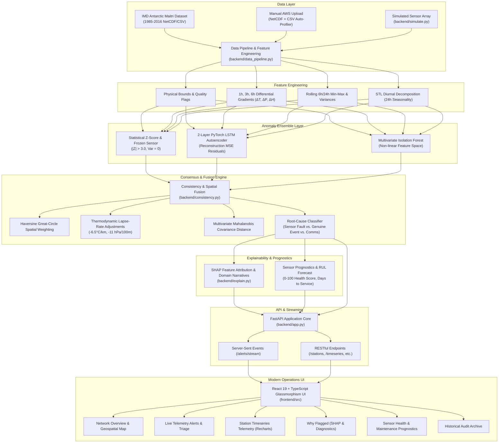
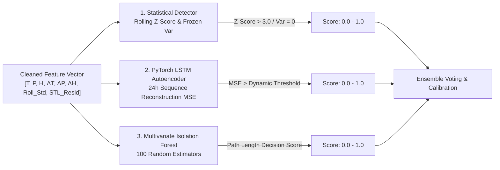
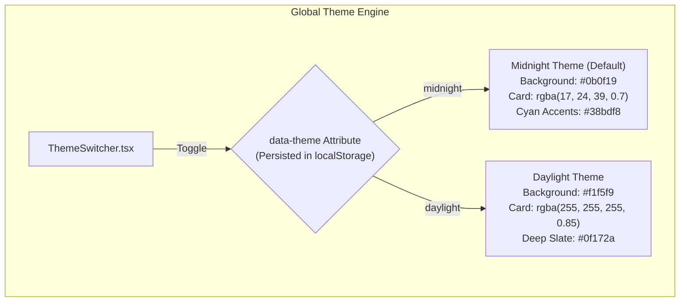
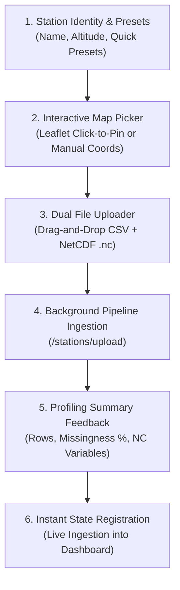
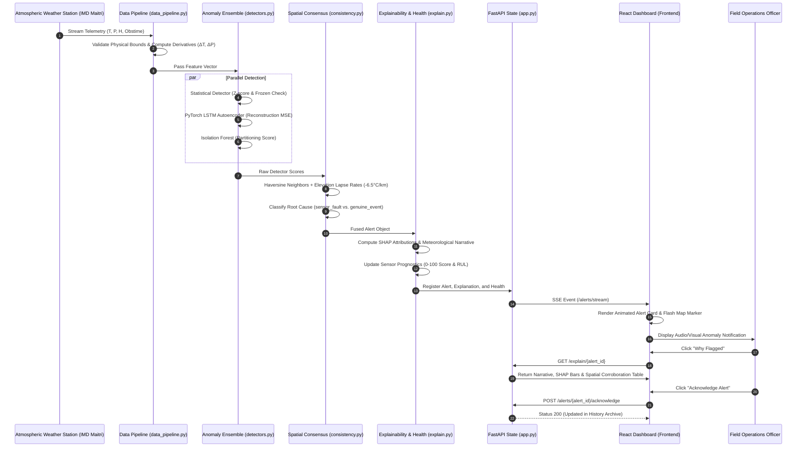

# 🛰️ SkyguardAI: Comprehensive Project & UI Architecture Guide
### Atmospheric Sensor Anomaly Detection, Spatial-Thermodynamic Consensus & Operations Platform

---

## 📑 Table of Contents
1. [Executive Summary & Core Mission](#1-executive-summary--core-mission)
2. [End-to-End System Architecture](#2-end-to-end-system-architecture)
3. [Repository Directory & File Map](#3-repository-directory--file-map)
4. [Backend Analytical & ML Engines](#4-backend-analytical--ml-engines)
   - [4.1 Data Ingestion & Physical Validation Pipeline](#41-data-ingestion--physical-validation-pipeline)
   - [4.2 Multi-Model Anomaly Detection Ensemble](#42-multi-model-anomaly-detection-ensemble)
   - [4.3 Spatial-Thermodynamic Consensus & Fusion](#43-spatial-thermodynamic-consensus--fusion)
   - [4.4 Explainable AI (XAI) & Meteorological Domain Narratives](#44-explainable-ai-xai--meteorological-domain-narratives)
   - [4.5 Sensor Prognostics & Health Scoring Engine](#45-sensor-prognostics--health-scoring-engine)
   - [4.6 Real-Time Simulation & Synthetic Fault Generator](#46-real-time-simulation--synthetic-fault-generator)
5. [Complete REST & Streaming SSE API Reference](#5-complete-rest--streaming-sse-api-reference)
6. [Frontend & User Interface (UI) Deep-Dive](#6-frontend--user-interface-ui-deep-dive)
   - [6.1 Technology Stack & Architecture](#61-technology-stack--architecture)
   - [6.2 Design System, Glassmorphism & Theme Engine](#62-design-system-glassmorphism--theme-engine)
   - [6.3 Global Navigation & Connectivity Heartbeat (`Navbar.tsx`)](#63-global-navigation--connectivity-heartbeat-navbartsx)
   - [6.4 Page 1: Network Overview (`NetworkOverview.tsx`)](#64-page-1-network-overview-networkoverviewtsx)
   - [6.5 Component: Station Onboarding Modal (`AddStationModal.tsx`)](#65-component-station-onboarding-modal-addstationmodaltsx)
   - [6.6 Page 2: Live Telemetry Alerts (`LiveAlerts.tsx`)](#66-page-2-live-telemetry-alerts-livealertstsx)
   - [6.7 Page 3: Station Detail & Timeseries (`StationDetail.tsx`)](#67-page-3-station-detail--timeseries-stationdetailtsx)
   - [6.8 Page 4: Root Cause & Explainability (`WhyFlagged.tsx`)](#68-page-4-root-cause--explainability-whyflaggedtsx)
   - [6.9 Page 5: Sensor Health & Prognostics (`SensorHealth.tsx`)](#69-page-5-sensor-health--prognostics-sensorhealthtsx)
   - [6.10 Page 6: Historical Alert Archive (`History.tsx`)](#610-page-6-historical-alert-archive-historytsx)
   - [6.11 Micro-Component: Confidence Gauge (`ConfidenceGauge.tsx`)](#611-micro-component-confidence-gauge-confidencegaugetsx)
7. [Data Flow & Operational Execution Lifecycle](#7-data-flow--operational-execution-lifecycle)
8. [Installation, Development & Deployment Guide](#8-installation-development--deployment-guide)

---

## 1. Executive Summary & Core Mission

**SkyguardAI** is a mission-critical atmospheric intelligence, sensor anomaly detection, spatial-temporal consensus, and explainability platform. It is engineered to monitor high-frequency meteorological telemetry from Automated Weather Stations (AWS) deployed in extreme, isolated, and harsh environments—most notably ground-truth observations from the **Indian Meteorological Department (IMD) Antarctic Maitri Research Station (-70.75°S, 11.74°E, elevation 117m)**, spanning continuous recordings from 1985 through 2016, alongside distributed sensor networks across the Himalayas, Central India, and Rocky Mountain testbeds.

### The Domain Challenge
Standard anomaly detectors flag statistical outliers without domain awareness. In meteorology:
1. **Severe Weather vs. Sensor Malfunction**: A sudden $15\,\text{hPa}$ pressure drop combined with high winds can represent a genuine cyclonic depression or polar blizzards, not a faulty barometer.
2. **Elevation & Microclimates**: Two adjacent mountain stations separated by 10 kilometers may record vastly different temperatures purely due to thermodynamic adiabatic lapse rates ($-6.5^\circ\text{C}/\text{km}$), which standard spatial filters misinterpret as anomalies.
3. **Black-Box Confusion**: Field operators cannot trust uninterpretable machine learning alerts when dispatching high-cost maintenance expeditions or issuing blizzard advisories.

### The SkyguardAI Solution
SkyguardAI resolves these challenges through an integrated 4-tier pipeline:
- **Multi-Model Anomaly Ensemble**: Combines statistical Z-scores/STL decomposition, a 2-layer PyTorch LSTM Autoencoder, and an unsupervised Multivariate Isolation Forest.
- **Spatial & Thermodynamic Consensus**: Normalizes station readings across altitude differences using dry adiabatic and barometric lapse rates, cross-referencing Haversine neighbors and Mahalanobis covariance distance.
- **Explainable AI (XAI)**: Calculates SHAP feature attribution vectors ($\phi_i$) and automatically constructs natural language meteorological narratives explaining *why* an event was flagged.
- **Predictive Prognostics**: Computes continuous $0-100$ sensor health scores, degradation velocity, and Remaining Useful Life (RUL) maintenance schedules.

---

## 2. End-to-End System Architecture



---

## 3. Repository Directory & File Map

```text
SkyguardAI/
├── backend/
│   ├── app.py                 # FastAPI application, route handlers, SSE generator & global state
│   ├── config.py              # Strict domain Enums (Severity, RootCause, Parameter) & CORS config
│   ├── consistency.py         # Haversine spatial fusion, thermodynamic lapse rates & Mahalanobis
│   ├── data_pipeline.py       # IMD Maitri dataset ingestion, auto-profiler & feature engineering
│   ├── detectors.py           # Statistical, 2-layer PyTorch LSTM Autoencoder & Isolation Forest
│   ├── explain.py             # SHAP attributions, domain meteorological narratives & health scoring
│   ├── simulate.py            # Spatial station network generator & synthetic fault injector
│   └── smoke_test.py          # Quick backend verification and regression testing script
├── frontend/
│   ├── index.html             # Single-page application entrypoint
│   ├── package.json           # React 19, TypeScript, Leaflet, Recharts, Lucide dependencies
│   ├── vite.config.ts         # Vite bundler with modern ESM output
│   └── src/
│       ├── main.tsx           # React DOM root bootstrap
│       ├── App.tsx            # Global layout wrapper & HashRouter route definitions
│       ├── config.ts          # API Base URL resolver (VITE_API_URL fallback)
│       ├── api.ts             # Typed REST HTTP client & SSE EventSource listener
│       ├── types.ts           # TypeScript interfaces matching backend models & contracts
│       ├── index.css          # Design system, CSS custom properties, glassmorphism & themes
│       ├── components/
│       │   ├── Navbar.tsx         # Frosted glass header, system heartbeat & navigation tabs
│       │   ├── ThemeSwitcher.tsx  # Dynamic Midnight / Daylight mode switcher
│       │   ├── AddStationModal.tsx # Interactive Leaflet location picker & NetCDF/CSV profiler
│       │   └── ConfidenceGauge.tsx # Circular SVG consensus confidence meter
│       └── pages/
│           ├── NetworkOverview.tsx # Station grid, Leaflet DarkMatter map & KPI metrics
│           ├── LiveAlerts.tsx      # Real-time SSE alert triage, severity filtering & search
│           ├── StationDetail.tsx   # 72-hour multi-parameter timeseries charts (Recharts)
│           ├── WhyFlagged.tsx      # SHAP attributions, reasoning chain & domain narratives
│           ├── SensorHealth.tsx    # Prognostic health gauge (0-100), trend & RUL forecast
│           └── History.tsx         # Historical alert archive, audit trail & status filters
├── data/
│   ├── raw/                   # Raw IMD Maitri CSV, NetCDF files, and uploaded AWS archives
│   ├── processed/             # Cleaned Parquet tables and PyTorch model checkpoints
│   └── simulated/             # Precomputed simulated network snapshots and scenario files
├── tests/
│   ├── test_detectors.py      # Unit tests for Statistical, LSTM, and Isolation Forest
│   ├── test_consistency.py    # Unit tests for spatial lapse rate and Mahalanobis fusion
│   ├── test_explain.py        # Unit tests for SHAP attributions and domain narratives
│   └── evaluate_models.py     # Evaluation benchmarks for precision, recall, and ROC-AUC
├── Dockerfile                 # Multi-stage production container build
├── docker-compose.yml         # Containerized backend-frontend orchestration
├── requirements.txt           # Python backend dependencies
├── PRD.md                     # Product Requirements Document
├── DOCUMENTATION.md           # Backend technical documentation
├── FRONTEND_ARCHITECTURE.md   # Dedicated frontend architecture specification
└── TECHSTACK.md               # Technology stack rationale and methodology
```

---

## 4. Backend Analytical & ML Engines

### 4.1 Data Ingestion & Physical Validation Pipeline
**Module**: [`backend/data_pipeline.py`](file:///c:/SkyguardAI/backend/data_pipeline.py)

1. **Physical Boundary Filtering**: Rejects physically impossible atmospheric measurements before model evaluation:
   - Surface Temperature: $-90^\circ\text{C} \le T \le +60^\circ\text{C}$
   - Barometric Pressure: $500\,\text{hPa} \le P \le 1100\,\text{hPa}$
   - Relative Humidity: $0\% \le H \le 100\%$
   - Wind Speed: $0\,\text{m/s} \le W \le 100\,\text{m/s}$
2. **Missing Interval Resolution**: Identifies missing temporal gaps and utilizes forward-filling (max 3 hours) or cubic spline interpolation for continuous series.
3. **Causal Feature Engineering**:
   - **Time Derivatives ($\Delta_1, \Delta_3, \Delta_6$)**: Computes 1-hour, 3-hour, and 6-hour rate-of-change metrics for temperature, pressure, and humidity.
   - **Rolling Statistics**: Computes 6-hour and 24-hour moving averages, standard deviations, and min-max spreads.
   - **STL Seasonal-Trend Decomposition**: Decomposes telemetry into trend ($T_t$), 24-hour diurnal seasonal cycle ($S_t$), and residual noise ($R_t$).
4. **Automated Multi-Format Ingestion (`ingest_station_files`)**:
   - Profiles uploaded CSV and NetCDF datasets on the fly.
   - Automatically detects time dimension names (`time`, `obstime`, `datetime`, `Date`), cross-matches variable aliases (`T`, `temp`, `temperature`, `MSLP`, `pres`, `RH`), and calculates column-level missingness percentages.
   - Saves final analytical feature matrices in columnar Apache Parquet format.

---

### 4.2 Multi-Model Anomaly Detection Ensemble
**Module**: [`backend/detectors.py`](file:///c:/SkyguardAI/backend/detectors.py)

SkyguardAI operates a three-model ensemble combining fast rule-based statistics, sequential deep learning, and unsupervised multi-dimensional partitioning.



#### 1. Statistical Detector (`statistical_detect`)
- **Rolling Z-Score**: Computes normalized deviation $Z = \frac{x_t - \mu_{24h}}{\sigma_{24h}}$. An anomaly is triggered if $|Z| \ge 3.0$.
- **Frozen Sensor Check**: Evaluates variance over a rolling 6-hour window ($\sigma^2_{\text{window}} < 10^{-5}$); detects frozen sensor outputs or hardware pin failures.
- **Physical Rate-of-Change Limit**: Flags impossible jumps, such as $\Delta T > 8^\circ\text{C}$ in 1 hour or $\Delta P > 12\,\text{hPa}$ in 1 hour.

#### 2. PyTorch LSTM Autoencoder (`LSTMAutoencoder`)
- **Architecture**: A 2-layer sequence-to-sequence Recurrent Autoencoder with hidden dimensions $128 \to 64 \to 128$.
- **Temporal Window**: Ingests 24 consecutive hourly timesteps ($T=24$) across multivariate features.
- **Reconstruction Error**: Computes per-feature Mean Squared Error:
  $$\text{MSE}_t = \frac{1}{d} \sum_{i=1}^{d} \left( x_{t,i} - \hat{x}_{t,i} \right)^2$$
- Points with reconstruction errors exceeding the 98.5th percentile of normal baseline operations are flagged as non-linear temporal anomalies.

#### 3. Multivariate Isolation Forest (`IsolationForestDetector`)
- Employs 100 orthogonal isolation trees trained on multi-dimensional telemetry spaces.
- Isolates complex multivariate anomalies (e.g., normal temperature and normal pressure individually, but an impossible thermodynamic combination at high altitude).

#### 4. Model Agreement & Sensitivity (`compare_detectors`)
- Generates a comparison matrix displaying individual detector scores ($0.0 - 1.0$), binary trigger flags, and an ensemble agreement score ($0\% - 100\%$).

---

### 4.3 Spatial-Thermodynamic Consensus & Fusion
**Module**: [`backend/consistency.py`](file:///c:/SkyguardAI/backend/consistency.py)

The critical intelligence differentiator of SkyguardAI is spatial consensus fusion: cross-referencing flagged station readings with neighboring network stations to determine whether an anomaly is a localized **hardware fault** or a widespread **genuine atmospheric event**.

#### 1. Haversine Spatial Weighting
Calculates great-circle distance $d(s_i, s_j)$ between station coordinates:
$$a = \sin^2\left(\frac{\Delta \phi}{2}\right) + \cos(\phi_1)\cos(\phi_2)\sin^2\left(\frac{\Delta \lambda}{2}\right)$$
$$d = 2 R \arctan2\left(\sqrt{a}, \sqrt{1-a}\right)$$
Neighboring stations within radius $R_{\max} = 150\,\text{km}$ are assigned exponential decay weights $w_{ij} = \exp\left(-\frac{d(s_i, s_j)}{\tau}\right)$.

#### 2. Thermodynamic Lapse-Rate Adjustments
Raw neighbor comparisons fail across varying topography. SkyguardAI adjusts expected values according to physical atmospheric physics:
- **Temperature Lapse Rate**: Normalizes expected temperature by elevation difference $\Delta z = z_{\text{neighbor}} - z_{\text{station}}$:
  $$T_{\text{expected}} = T_{\text{neighbor}} + \left(-0.0065^\circ\text{C}/\text{m}\right) \times (z_{\text{station}} - z_{\text{neighbor}})$$
- **Barometric Pressure Lapse Rate**: Adjusts pressure via standard atmosphere barometric gradient:
  $$P_{\text{expected}} = P_{\text{neighbor}} + \left(-0.11\,\text{hPa}/\text{m}\right) \times (z_{\text{station}} - z_{\text{neighbor}})$$

#### 3. Multivariate Mahalanobis Distance
Calculates distance against historical covariance matrix $\boldsymbol{\Sigma}$:
$$D_M(\mathbf{x}) = \sqrt{(\mathbf{x} - \boldsymbol{\mu})^T \boldsymbol{\Sigma}^{-1} (\mathbf{x} - \boldsymbol{\mu})}$$
Accounts for correlated meteorological variables (e.g., temperature vs. saturation vapor pressure).

#### 4. Root-Cause Classification (`fuse_and_classify`)
Combines detector scores and spatial consistency into an overall consensus score:
$$\text{Score}_{\text{final}} = 0.25\,S_{\text{stat}} + 0.35\,S_{\text{lstm}} + 0.20\,S_{\text{iso}} + 0.20\,S_{\text{cons}}$$
- **`sensor_fault`**: Station is severely flagged by local detectors, but all altitude-corrected neighboring stations observe normal conditions ($S_{\text{cons}} \approx 0$).
- **`genuine_event`**: Multiple neighboring stations corroborate the deviation, matching thermodynamic expectations (e.g. passage of a polar cold front or squall line).
- **`comms_error`**: Null telemetry, repetitive bit-flips, or dropped packets.

---

### 4.4 Explainable AI (XAI) & Meteorological Domain Narratives
**Module**: [`backend/explain.py`](file:///c:/SkyguardAI/backend/explain.py)

#### 1. SHAP Feature Attribution
Computes exact Shapley feature importance values ($\phi_i$) indicating the directional contribution of each meteorological variable toward the anomaly classification:
- **`increases_anomaly`**: Pushes the ensemble confidence higher.
- **`decreases_anomaly`**: Counter-evidence that stabilizes the reading.

#### 2. Domain-Grounded Meteorological Narratives
Translates feature vectors into clear, human-understandable diagnostics. For instance:
> *"Station #11 (Maitri Research Station) detected an acute Barometric Pressure drop of -14.2 hPa over 3 hours. Altitude-adjusted spatial cross-referencing with Bharati Station corroborates regional pressure depression, indicating a polar low-pressure system rather than a transducer calibration fault."*

#### 3. Step-by-Step Reasoning Chain
Constructs an auditable 5-step diagnostic breakdown for mission operators:
1. **Statistical Outlier Detection**: Identifies $|Z| > 3.0$ excursion or variance collapse.
2. **Reconstruction Residual Evaluation**: Verifies whether LSTM Autoencoder failed temporal reconstruction.
3. **Spatial Neighbor Corroboration**: Evaluates elevation-corrected deviations at adjacent stations.
4. **Thermodynamic Consistency Check**: Validates if physical lapse rate constraints were violated.
5. **Operational Verdict**: Outputs final root cause, severity rating, and confidence percentage.

---

### 4.5 Sensor Prognostics & Health Scoring Engine
**Module**: [`backend/explain.py` -> `predict_health`](file:///c:/SkyguardAI/backend/explain.py)

Continuous hardware health tracking calculates a prognostic score between **0 and 100**:
- **Baseline Health**: Initialized at $100.0$.
- **Penalties**: Deductions applied for persistent variance anomalies, high reconstruction residuals, calibration drift, and active unacknowledged alerts.
- **Health Rating Categories**:
  - `80 - 100`: **Nominal** (Green) — System fully operational.
  - `50 - 79`: **Degrading** (Amber) — Sensor exhibiting calibration drift or intermittent dropouts.
  - `< 50`: **Fault / Critical** (Red) — Urgent hardware inspection or replacement required.
- **Degradation Trend**: Classified as `improving`, `stable`, or `degrading`.
- **Remaining Useful Life (RUL)**: Computes estimated days until required maintenance based on degradation trajectory.

---

### 4.6 Real-Time Simulation & Synthetic Fault Generator
**Module**: [`backend/simulate.py`](file:///c:/SkyguardAI/backend/simulate.py)

Enables operators and QA suites to test the pipeline against real-world failure modes:
| Scenario ID | Fault Injected | Expected Detection & Classification |
| :--- | :--- | :--- |
| `spike` | Sudden $+18^\circ\text{C}$ instantaneous transient jump | Statistical Z-score + LSTM flagged; Classified as `sensor_fault` |
| `frozen_sensor` | Constant flatline reading for $\ge 12$ hours ($\sigma^2 = 0$) | Frozen detector triggered; Classified as `sensor_fault` |
| `calibration_drift` | Gradual $+0.35^\circ\text{C}/\text{day}$ linear baseline deviation | Mahalanobis + Autoencoder flagged; Classified as `sensor_fault` |
| `comms_dropout` | Null readings and missing packet bursts | Rate-of-change + completeness check; Classified as `comms_error` |
| `genuine_event` | Coherent $-14\,\text{hPa}$ pressure drop across entire cluster | Flagged by detectors, but corroborated by neighbors; Classified as `genuine_event` |
| `all` | Combination of various faults across different cluster nodes | Full multi-station network stress test |

---

## 5. Complete REST & Streaming SSE API Reference

The SkyguardAI backend exposes a REST and Server-Sent Events (SSE) API built with FastAPI:

### Core Endpoints

| HTTP Method | Endpoint Path | Query / Body Parameters | Response Output | Description |
| :--- | :--- | :--- | :--- | :--- |
| `GET` | `/health` | None | `{"status": "ok", "stations_count": int, "alerts_count": int}` | Backend health check and state confirmation |
| `GET` | `/stations` | None | `List[Station]` | Retrieves all monitored stations (coordinates, status, elevation, source) |
| `DELETE` | `/stations/{station_id}` | `station_id: int` | `{"status": "deleted", "station_id": int}` | Decommissions an AWS station and removes its timeseries, alerts, and health records |
| `GET` | `/alerts` | `status`, `station_id`, `min_severity`, `since`, `limit` | `List[Alert]` | Retrieves filtered active or historical telemetry alerts |
| `POST` | `/alerts/{alert_id}/acknowledge` | `alert_id: int` | `{"status": "acknowledged"}` | Acknowledges an active anomaly alert |
| `GET` | `/alerts/stream` | None | `text/event-stream` (SSE) | Live Server-Sent Events stream cycling real-time alert events |
| `GET` | `/stations/{station_id}/timeseries` | `hours: int` (default 72) | `{"station_id": int, "hours": int, "data": List[TimeseriesPoint]}` | Retrieves high-resolution temperature, pressure, and humidity timeseries |
| `GET` | `/sensor-health/{station_id}` | `station_id: int` | `SensorHealth` | Retrieves 0-100 health score, degradation trend, and RUL forecast |
| `GET` | `/explain/{alert_id}` | `alert_id: int` | `Explanation` | Returns SHAP feature contributions, reasoning chain, and domain narratives |
| `POST` | `/simulate/scenario` | `scenario: str`, `city: str` | `{"status": "success", "scenario": str, ...}` | Dynamically injects synthetic fault scenarios into the station array |
| `POST` | `/stations/upload` | `name`, `latitude`, `longitude`, `elevation`, `upload_type`, `csv_file`, `nc_file?` | `AddStationResponse` | Ingests new AWS station via CSV-Only (standalone telemetry) or Dual (CSV + NetCDF grid) with automated profiling, cleaning, and ML evaluation |

---

## 6. Frontend & User Interface (UI) Deep-Dive

### 6.1 Technology Stack & Architecture
- **Framework**: React 19 (`react`, `react-dom`) with TypeScript 5.8+
- **Bundler**: Vite 6 with instant Hot Module Replacement (HMR)
- **Routing**: `react-router-dom` v6 using `HashRouter` (ensures routing stability without server rewrites)
- **Geospatial Mapping**: Leaflet 1.9 & `react-leaflet` with custom animated CSS/SVG marker pins and DarkMatter tiles
- **Timeseries Visualization**: `recharts` for responsive SVG area charts, gradient fills, and reference zones
- **Iconography**: `lucide-react` modern minimalist icon library
- **Styling Architecture**: Pure Vanilla CSS design system with CSS custom properties, backdrop blur glassmorphism, and responsive CSS grid/flexbox layouts

---

### 6.2 Design System, Glassmorphism & Theme Engine
The interface implements a high-tech aerospace aesthetic designed for 24/7 command centers.



#### Core Design Tokens (`frontend/src/index.css`)
- **Glassmorphism Panels (`.glass-panel`)**:
  - `background`: `var(--bg-card)` with `backdrop-filter: blur(16px)`
  - `border`: `1px solid var(--border-card)`
  - `box-shadow`: Multi-layered ambient shadows (`0 8px 32px rgba(0, 0, 0, 0.35)`)
- **Curated Semantic Palette**:
  - **Nominal / Operational**: Emerald Green (`#10b981`)
  - **Degrading / Medium Alert**: Warm Amber (`#f59e0b`)
  - **Critical Fault / High Alert**: Crimson Rose (`#f43f5e`)
  - **Atmospheric Data Channels**: Cyan (`#38bdf8`), Coral (`#fb7185`), Mint (`#34d399`), Purple (`#c084fc`)

---

### 6.3 Global Navigation & Connectivity Heartbeat (`Navbar.tsx`)
**File**: [`frontend/src/components/Navbar.tsx`](file:///c:/SkyguardAI/frontend/src/components/Navbar.tsx)

- **Sticky Header**: Stays pinned to the top of the viewport with frosted blur backdrop.
- **Brand Identity**: Glowing radar logo with stylized `SKYGUARD.AI` typography.
- **Core Connectivity Heartbeat**: Polls `GET /health` every 15 seconds. Renders a glowing live status pill:
  - `CORE ONLINE`: Glowing green radar icon indicating healthy backend link.
  - `DISCONNECTED`: Rose red warning badge indicating lost network connectivity.
  - `INITIALIZING`: Amber pulse during initial bootstrap.
- **Navigation Menu**: Route buttons with active path detection, visual glow indicators, and Lucide icons:
  1. 📍 **Network Overview** (`/`)
  2. 📡 **Live Alerts** (`/alerts`)
  3. 📈 **Station Detail** (`/station/1`)
  4. ⚠️ **Why Flagged** (`/why-flagged/101`)
  5. 🛡️ **Sensor Health** (`/health/1`)
  6. 📜 **History** (`/history`)
- **Integrated Theme Switcher**: Sun/Moon toggle button instantly switching between Midnight and Daylight visual modes.

---

### 6.4 Page 1: Network Overview (`NetworkOverview.tsx`)
**Route**: `/` | **File**: [`frontend/src/pages/NetworkOverview.tsx`](file:///c:/SkyguardAI/frontend/src/pages/NetworkOverview.tsx)

The command center landing page provides an immediate geospatial and operational snapshot of the entire atmospheric sensor array.

```text
+---------------------------------------------------------------------------------------------------+
|  NETWORK OVERVIEW                                                    [+ Add Station] [Reset View] |
|  Distributed atmospheric sensor nodes, telemetry health, and geospatial status                     |
+---------------------------------------------------------------------------------------------------+
|  [TOTAL: 12]           [NORMAL: 9]              [DEGRADING: 2]            [CRITICAL FAULT: 1]     |
+---------------------------------------------------------------------------------------------------+
|  +-------------------------------------------------------------+  +----------------------------+  |
|  |                                                             |  | STATION SEARCH & FILTERS   |  |
|  |               INTERACTIVE LEAFLET GEOSPATIAL MAP            |  | [All] [Normal] [Fault]     |  |
|  |                                                             |  +----------------------------+  |
|  |       * Station #11 (Maitri Antarctica) [-70.75, 11.74]     |  | STATION CARD: Maitri AWS   |  |
|  |       * Station #1 (Boulder AWS)                            |  | Status: DEGRADING          |  |
|  |       * Station #3 (Longmont AWS)                           |  | Elev: 117m | Source: Real  |  |
|  |                                                             |  | [View Charts] [Health]     |  |
|  +-------------------------------------------------------------+  +----------------------------+  |
+---------------------------------------------------------------------------------------------------+
```

#### Key Capabilities & Features
1. **Top-Level KPI Summary Cards**:
   - Total Monitored Stations, Operational Nodes, Degrading Sensors, and Critical Faults.
2. **Interactive Leaflet Geospatial DarkMatter Map**:
   - Styled dark-matter tile layers with status-coded animated marker pins (Green, Amber, Rose).
   - Selected station receives a pulsating cyan locator halo.
   - Clickable popups displaying station name, coordinates, elevation, status, and direct navigation links.
3. **Map Navigation Controls (`MapViewController`)**:
   - Quick Region Jump Buttons: **India**, **Antarctica**, **Himalayas**, and **Global View**.
   - "Fit All Stations" reset button automatically computing boundary envelopes (`map.fitBounds`).
   - Clicking any station card triggers smooth flight animation (`map.flyTo`) directly centering the chosen node.
4. **Filterable Station Grid**:
   - Filter chips for status (`All`, `Normal`, `Degrading`, `Fault`).
   - Search input filtering by name or ID.
   - Detailed station cards displaying coordinates, elevation, operational source (`real` Antarctic dataset vs. `simulated`), and quick action buttons.
5. **Add Station Onboarding Trigger**:
   - Prominent `+ Add Station` button launching the multi-format ingestion modal.

---

### 6.5 Component: Station Onboarding Modal (`AddStationModal.tsx`)
**File**: [`frontend/src/components/AddStationModal.tsx`](file:///c:/SkyguardAI/frontend/src/components/AddStationModal.tsx)

A specialized operational modal enabling field scientists and technicians to onboard new Automated Weather Stations without downtime or restarting the application.



#### In-Depth Capabilities
- **Quick-Fill Research Station Presets**:
  - *Bharati Research Station* (Antarctica, Larsemann Hills: -69.41°S, 76.19°E)
  - *Himansh High-Altitude AWS* (Himalayas, Spiti Valley: 32.40°N, 77.62°E, 4080m)
  - *IMD Pune Central Observatory* (Maharashtra, India: 18.52°N, 73.86°E)
  - *Maitri Station AWS-2* (Antarctica, Schirmacher Oasis: -70.76°S, 11.74°E)
- **Interactive Mini Leaflet Location Picker**:
  - Draggable or click-to-place blue indicator pin automatically updating latitude and longitude inputs.
- **Dual File Drag-and-Drop Ingestion**:
  - Accepts both observational CSV telemetry and multi-dimensional NetCDF (`.nc`) files simultaneously.
- **Dynamic Profiling Summary Dialog**:
  - Displays detected rows, time spans, schema cross-matching, missingness percentages, and NetCDF dimensional structures upon completion.
  - Automatically redirects operators to the new station's live timeseries view.

---

### 6.6 Page 2: Live Telemetry Alerts (`LiveAlerts.tsx`)
**Route**: `/alerts` | **File**: [`frontend/src/pages/LiveAlerts.tsx`](file:///c:/SkyguardAI/frontend/src/pages/LiveAlerts.tsx)

The mission-critical alert triage dashboard displays real-time anomaly events arriving directly from the backend Server-Sent Events stream.

#### Key Capabilities & Features
- **Real-Time SSE Stream Listener**:
  - Connects to `/alerts/stream` via native browser `EventSource`.
  - Dynamically prepends newly detected anomalies to the top of the feed with visual fade-in effects.
  - Live indicator badge displaying `SSE STREAM ACTIVE (5s)` in green or `STREAM DISCONNECTED` in red upon connection loss.
- **Multi-Parameter Triage Filtering**:
  - Filter by Severity: `All`, `High`, `Medium`, `Low`.
  - Search box filtering against station name, summary text, or root cause.
- **Telemetry Anomaly Cards**:
  - Displays Station Name, Timestamp, Severity Pill, and Root Cause Badge (`sensor_fault`, `genuine_event`, `comms_error`).
  - Flagged parameter badges (e.g. Temperature, Pressure, Humidity).
  - Multi-model consensus confidence gauge ([ConfidenceGauge.tsx](file:///c:/SkyguardAI/frontend/src/components/ConfidenceGauge.tsx)).
  - One-click "Acknowledge" button dispatching `POST /alerts/{id}/acknowledge` and immediately updating status.
  - "Inspect Why Flagged" direct drill-down link leading to deep-dive explainability.

---

### 6.7 Page 3: Station Detail & Timeseries (`StationDetail.tsx`)
**Route**: `/station/:stationId` | **File**: [`frontend/src/pages/StationDetail.tsx`](file:///c:/SkyguardAI/frontend/src/pages/StationDetail.tsx)

Comprehensive 72-hour operational timeseries telemetry visualizer powered by high-performance Recharts graphs.

```text
+---------------------------------------------------------------------------------------------------+
|  STATION #11: Maitri Research Station (Antarctica)                 [Station Switcher] [Decommission]|
|  Lat: -70.75°S  Lon: 11.74°E  Elev: 117m  Status: DEGRADING                                        |
+---------------------------------------------------------------------------------------------------+
|  [Window: 24h | 72h | 168h]                 [Parameters: All | Temperature | Pressure | Humidity] |
+---------------------------------------------------------------------------------------------------+
|  +---------------------------------------------------------------------------------------------+  |
|  |  TEMPERATURE OVER TIME (°C)                                                                  |  |
|  |  [AreaChart with Rose/Coral Gradient, Tooltip displaying ISO timestamp & exact value]       |  |
|  |  *** Anomaly Zone Highlighted (ReferenceArea in translucent rose) ***                         |  |
|  +---------------------------------------------------------------------------------------------+  |
|  +---------------------------------------------------------------------------------------------+  |
|  |  BAROMETRIC PRESSURE (hPa)                                                                   |  |
|  |  [AreaChart with Cyan Gradient, dynamic Y-Axis bounds matching local pressure range]        |  |
|  +---------------------------------------------------------------------------------------------+  |
+---------------------------------------------------------------------------------------------------+
```

#### Key Capabilities & Features
1. **Dynamic Time Window Selector**:
   - Toggle between **24 Hours**, **72 Hours** (default), or **168 Hours** (7 Days) of high-resolution telemetry.
2. **Parameter Isolation Pills**:
   - Switch between **All Parameters**, **Temperature Only**, **Pressure Only**, or **Humidity Only**.
3. **Interactive Recharts Area Visualizations**:
   - Smooth cubic Bézier interpolation curves.
   - Glowing gradient fills with subtle grid backdrops.
   - Interactive crosshair tooltips rendering localized date, time, and precise scientific units.
   - Translucent pink/rose `ReferenceArea` shading anomalous time windows for immediate operator recognition.
4. **Summary Metric Badges**:
   - Current Value, Window Min, Window Max, and Rolling Standard Deviation.
5. **Station Decommissioning / Deletion Modal**:
   - Secure deletion modal requiring user confirmation before calling `DELETE /stations/{id}` to remove retired sensors.

---

### 6.8 Page 4: Root Cause & Explainability (`WhyFlagged.tsx`)
**Route**: `/why-flagged/:alertId` | **File**: [`frontend/src/pages/WhyFlagged.tsx`](file:///c:/SkyguardAI/frontend/src/pages/WhyFlagged.tsx)

The crown jewel of SkyguardAI's Explainable AI interface. Translates complex mathematical ensembles and spatial matrices into actionable, transparent operational evidence.

```text
+---------------------------------------------------------------------------------------------------+
|  ANOMALY DIAGNOSTIC & EXPLAINABILITY REPORT #101                        [Acknowledge Alert]       |
|  Station #11 (Maitri Research Station) | Severity: HIGH | Root Cause: SENSOR FAULT                |
+---------------------------------------------------------------------------------------------------+
|  [Tabs: 1. Overview  |  2. Contributing Factors  |  3. Reasoning Chain  |  4. Spatial Consensus]  |
+---------------------------------------------------------------------------------------------------+
|                                                                                                   |
|  TAB 1: METEOROLOGICAL DOMAIN NARRATIVE                                                           |
|  "Temperature sensor experienced a sudden anomalous spike of +18.4°C over 15 minutes.             |
|   Neighboring stations within 45km observed no corresponding thermal front. Classification:       |
|   Transducer hardware failure / local calibration anomaly."                                       |
|                                                                                                   |
|  TAB 2: SHAP FEATURE ATTRIBUTION BAR CHART                                                        |
|  * Temperature Rate-of-Change (ΔT_1h):  +0.58 [████████████████████] (Increases Anomaly)         |
|  * STL Diurnal Residual:                +0.32 [███████████         ] (Increases Anomaly)         |
|  * Barometric Consistency:              -0.12 [████                ] (Decreases Anomaly)         |
|                                                                                                   |
|  TAB 3: AUDITABLE REASONING CHAIN                                                                 |
|  Step 1: [FLAGGED]       Statistical Z-Score (|Z| = 4.2 > 3.0 threshold)                          |
|  Step 2: [UNPHYSICAL]    Rate of Change (+18.4°C/15min exceeds physical Antarctic boundary)       |
|  Step 3: [ISOLATED]      Lapse-rate adjusted neighbor consensus rejected widespread weather event|
|  Step 4: [VERDICT]       Confirmed Hardware Sensor Fault with 92% Ensemble Confidence             |
|                                                                                                   |
|  TAB 4: SPATIAL CORROBORATION MATRIX                                                              |
|  Neighbor Station | Distance | Elev Δ | Expected Reading | Observed | Corroborated?              |
|  Bharati AWS      | 42.1 km  | +82m   | -18.2°C          | -18.5°C  | NO (Disagrees with spike)  |
+---------------------------------------------------------------------------------------------------+
```

#### Detailed Section Breakdown
- **Alert Switcher & Summary Banner**:
  - Dropdown selector to switch between active alerts in memory.
  - Large status banner indicating station name, severity, confidence score, and root-cause classification.
- **Section Tab 1: Overview & Domain Narrative**:
  - Highlighted narrative card translating statistical telemetry anomalies into plain-English meteorological terms.
  - Model consensus breakdown showing individual votes from Statistical, LSTM Autoencoder, and Isolation Forest models.
- **Section Tab 2: Contributing Factors & SHAP Attributions**:
  - Horizontal bar graphs displaying SHAP attribution values ($\phi$).
  - Color-coded by direction: Crimson/Rose for `increases_anomaly`, Emerald for `decreases_anomaly`.
  - Displays Observed Value vs. Historical Baseline and Deviation Percentage.
- **Section Tab 3: Step-by-Step Reasoning Chain**:
  - Visual audit trail demonstrating how the pipeline progressed from initial signal detection to final consensus verdict.
- **Section Tab 4: Spatial Neighbor Corroboration**:
  - Table of nearby stations with calculated Haversine distance (km), elevation difference, thermodynamic expected value, actual reading, and corroboration status.
- **Operator Action Recommendations**:
  - Clear recommended next steps (e.g. *"Schedule on-site transducer recalibration"*, *"Inspect wiring for moisture intrusion"*, or *"Issue regional blizzard advisory"*).

---

### 6.9 Page 5: Sensor Health & Prognostics (`SensorHealth.tsx`)
**Route**: `/health/:stationId` | **File**: [`frontend/src/pages/SensorHealth.tsx`](file:///c:/SkyguardAI/frontend/src/pages/SensorHealth.tsx)

A predictive maintenance dashboard focused on hardware longevity, calibration drift, and failure prevention.

#### Key Capabilities & Features
- **Large Circular SVG Health Gauge**:
  - Smooth animated circular stroke indicating continuous $0-100$ health index.
  - Dynamic color transitions: Emerald ($\ge 80$), Amber ($50-79$), Rose ($< 50$).
- **Degradation Velocity & Trend Badge**:
  - Trend direction pill (`improving`, `stable`, `degrading`) with associated Lucide trend arrows.
- **Maintenance Schedule & RUL Countdown**:
  - Clear indicator card displaying estimated days until required servicing (e.g. *"Maintenance recommended in 14 days"*).
  - Last maintenance timestamp and service history records.
- **Subsystem Diagnostic Metrics**:
  - Transducer Calibration Drift
  - Signal-to-Noise Ratio (SNR)
  - Packet Delivery & Communication Stability
  - Power Supply / Battery Voltage Variance

---

### 6.10 Page 6: Historical Alert Archive (`History.tsx`)
**Route**: `/history` | **File**: [`frontend/src/pages/History.tsx`](file:///c:/SkyguardAI/frontend/src/pages/History.tsx)

An auditable archive of all acknowledged, resolved, and historical anomaly incidents across the network.

#### Key Capabilities & Features
- **Tabbed Audit Views**:
  - `Acknowledged`: Alerts reviewed and acknowledged by operators.
  - `Resolved`: Incidents where sensor readings have returned to nominal baselines.
  - `All Historical`: Full archive log.
- **Search & Multi-Facet Filtering**:
  - Search by station name, alert summary, or root cause.
  - Filter by severity rating (`All`, `High`, `Medium`, `Low`).
- **Archive Incident Cards**:
  - Timestamp, Station Badge, Severity Indicator, Summary, and direct link to review diagnostic explanation.

---

### 6.11 Micro-Component: Confidence Gauge (`ConfidenceGauge.tsx`)
**File**: [`frontend/src/components/ConfidenceGauge.tsx`](file:///c:/SkyguardAI/frontend/src/components/ConfidenceGauge.tsx)

A reusable, responsive circular SVG component used across `LiveAlerts.tsx` and `WhyFlagged.tsx`:
- Calculates circumference and `strokeDashoffset` dynamically based on a $0 - 100$ confidence percentage.
- Interpolates stroke color across three operational states:
  - $\ge 80\%$: Crimson (`#f43f5e`) — High certainty of anomaly.
  - $50\% - 79\%$: Amber (`#f59e0b`) — Moderate certainty.
  - $< 50\%$: Sky Blue (`#38bdf8`) — Low confidence / borderline.
- Displays centered percentage text and micro-label.

---

## 7. Data Flow & Operational Execution Lifecycle

Here is the exact lifecycle of an atmospheric telemetry observation from ingestion to operator action:



---

## 8. Installation, Development & Deployment Guide

### 8.1 Local Environment Setup

#### Prerequisites
- **Python**: 3.10 or 3.11
- **Node.js**: 18+ or 20+
- **Git**

#### 1. Backend Setup
```bash
# Clone the repository
git clone https://github.com/<your-username>/SkyguardAI.git
cd SkyguardAI

# Create virtual environment
python -m venv .venv

# Activate virtual environment
# Windows:
.venv\Scripts\activate
# Linux/macOS:
# source .venv/bin/activate

# Install dependencies
pip install -r requirements.txt

# Start FastAPI backend server
uvicorn backend.app:app --host 0.0.0.0 --port 8000 --reload
```
The backend API is now running at `http://localhost:8000` with Swagger documentation available at `http://localhost:8000/docs`.

#### 2. Frontend Setup
```bash
# In a new terminal, navigate to the frontend directory
cd SkyguardAI/frontend

# Install node dependencies
npm install

# Start Vite development server
npm run dev
```
Open your browser and navigate to `http://localhost:5173`.

---

### 8.2 Docker Orchestration
SkyguardAI includes a ready-to-run multi-container setup via Docker Compose:

```bash
docker-compose up --build -d
```
- **Backend API**: `http://localhost:8000`
- **Health Verification**: `http://localhost:8000/health`

---

### 8.3 Running the Test Suite
The repository includes a comprehensive unit and regression testing suite covering all detectors, physical formulas, and explainability routines:

```bash
# Run all tests with verbose output
pytest tests/ -v

# Run individual test modules
pytest tests/test_detectors.py -v
pytest tests/test_consistency.py -v
pytest tests/test_explain.py -v

# Run backend smoke test
python backend/smoke_test.py
```

---

### 8.4 Triggering Synthetic Fault Scenarios
You can test the entire pipeline live from your terminal or curl by triggering fault scenarios:

```bash
# Inject a sudden temperature spike into the network
curl -X POST "http://localhost:8000/simulate/scenario?scenario=spike&city=Boulder"

# Inject a flatlined frozen sensor failure
curl -X POST "http://localhost:8000/simulate/scenario?scenario=frozen_sensor&city=Boulder"

# Simulate a genuine severe atmospheric weather event (passing cyclone)
curl -X POST "http://localhost:8000/simulate/scenario?scenario=genuine_event&city=Boulder"
```
The connected React UI will immediately update its SSE alert feed, map pin statuses, and explainability reasoning chains.

---

> **SkyguardAI Platform Architecture & UI Guide**  
> *Engineered for High-Reliability Atmospheric Sensor Defense and Operations.*
