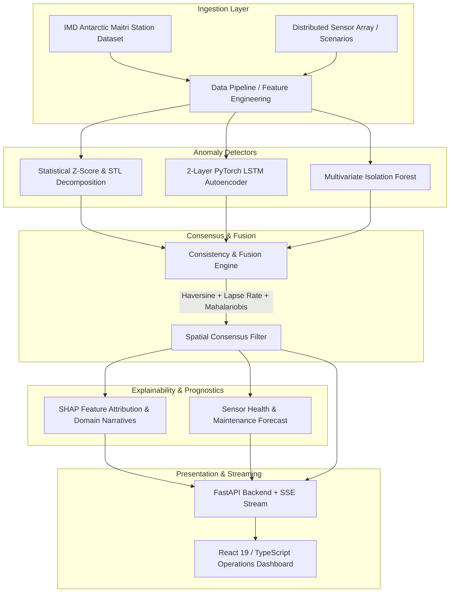

# 🛰️ SkyguardAI
### Atmospheric Sensor Anomaly Detection, Spatial Consensus & Explainability Platform

[](https://fastapi.tiangolo.com)
[](https://pytorch.org)
[](https://react.dev)
[](https://www.typescriptlang.org)
[](https://vitejs.dev)
[](https://www.docker.com)

SkyguardAI is an operational atmospheric anomaly detection, spatial consensus fusion, and sensor prognostics platform. It processes high-resolution weather telemetry—including real historical observations from the **IMD Antarctic Maitri Research Station (-70.75°S, 11.74°E)** and distributed meteorological sensor arrays.

---

## 🌟 Key Capabilities

- 🤖 **Multi-Model Anomaly Ensemble**: Combines Statistical Z-scores/STL decomposition, a 2-layer PyTorch LSTM Autoencoder, and Isolation Forest.
- 🌐 **Spatial & Thermodynamic Consensus**: Haversine distance weighting and elevation lapse-rate normalization ($-6.5^\circ\text{C}/\text{km}$, $-11\,\text{hPa}/100\text{m}$) coupled with multivariate Mahalanobis distance.
- 🔍 **Explainable AI (XAI)**: SHAP feature attribution bar charts and automated natural language meteorological domain narratives.
- 🛡️ **Sensor Health Prognostics**: Continuous $0 - 100$ health scoring, degradation trend monitoring, and Remaining Useful Life (RUL) maintenance forecasting.
- 📡 **Real-Time Streaming**: Server-Sent Events (SSE) `/alerts/stream` broadcasting live anomaly events to the dashboard.
- 🗺️ **Geospatial Command Center**: Leaflet DarkMatter map with status-coded animated marker pins and Recharts telemetry graphs.

---

## 🏗️ Architecture



---

## 📂 Repository Layout

```text
SkyguardAI/
├── backend/
│   ├── app.py                 # FastAPI application, route handlers, SSE generator
│   ├── config.py              # Strict domain Enums & CORS config
│   ├── consistency.py         # Spatial Haversine, lapse rate & Mahalanobis fusion
│   ├── data_pipeline.py       # IMD Maitri dataset ingestion & feature engineering
│   ├── detectors.py           # Statistical, LSTM Autoencoder & Isolation Forest models
│   ├── explain.py             # SHAP attributions, narratives & health prognostics
│   ├── simulate.py            # Station network generator & synthetic fault injection
│   └── smoke_test.py          # Quick backend verification script
├── frontend/
│   ├── src/
│   │   ├── components/        # Navbar & layout components
│   │   ├── pages/             # NetworkOverview, LiveAlerts, StationDetail, WhyFlagged, Health, History
│   │   ├── api.ts             # Typed REST & SSE EventSource client
│   │   └── index.css          # Design system & glassmorphism styles
│   ├── package.json
│   └── vite.config.ts
├── data/                      # Raw, processed Parquet files & trained model checkpoints
├── tests/                     # Comprehensive test suite (detectors, consistency, explainability)
├── DOCUMENTATION.md           # Full system architecture documentation
├── FRONTEND_ARCHITECTURE.md   # Dedicated frontend & UI structure documentation
├── SkyguardAI_Documentation.docx
├── SkyguardAI_Frontend_Documentation.docx
├── Dockerfile                 # Backend container definition
├── docker-compose.yml         # Container orchestration
└── requirements.txt           # Python dependencies
```

---

## 🚀 Quickstart

### 1. Local Development

#### Backend Setup
```bash
# Clone the repository
git clone https://github.com/<your-username>/SkyguardAI.git
cd SkyguardAI

# Create virtual environment & install dependencies
python -m venv .venv
# On Windows:
.venv\Scripts\activate
# On Linux/macOS:
# source .venv/bin/activate

pip install -r requirements.txt

# Start FastAPI backend
uvicorn backend.app:app --host 0.0.0.0 --port 8000 --reload
```

#### Frontend Setup
```bash
cd frontend
npm install
npm run dev
```
Open [http://localhost:5173](http://localhost:5173) in your browser.

---

### 2. Docker Deployment

```bash
docker-compose up --build -d
```
- API Base: `http://localhost:8000`
- Health Check: `http://localhost:8000/health`

---

## 🧪 Running Tests

```bash
pytest tests/ -v
```

---

## 📄 Documentation

- Full Platform Architecture: [DOCUMENTATION.md](DOCUMENTATION.md)
- Technology Stack & Methodology: [TECHSTACK.md](TECHSTACK.md)
- UI & Frontend Deep-Dive: [FRONTEND_ARCHITECTURE.md](FRONTEND_ARCHITECTURE.md)
- Microsoft Word Reports: `SkyguardAI_Documentation.docx`, `SkyguardAI_Frontend_Documentation.docx`, & `SkyguardAI_TechStack_Documentation.docx`

