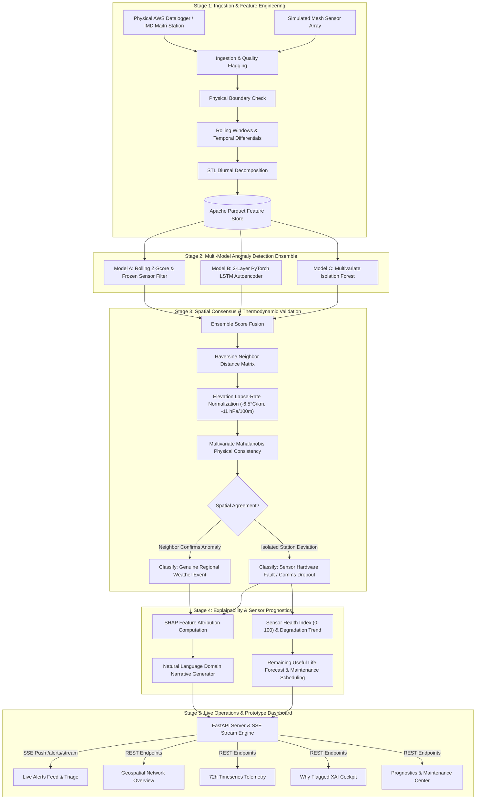

# 🛰️ SkyguardAI — Technology Stack & Implementation Methodology

> **Platform Overview**: SkyguardAI is an operational atmospheric anomaly detection, spatial consensus fusion, and sensor prognostics system designed for Automatic Weather Station (AWS) networks and extreme meteorological environments (including IMD Antarctic Maitri Station).

---

## 1. Comprehensive Technology Stack

```
+---------------------------------------------------------------------------------------------------------+
|                                        SKYGUARDAI TECHNOLOGY STACK                                      |
+=========================================================================================================+
|  PRESENTATION LAYER    | React 19 | TypeScript 5.8+ | Vite 8.x | React-Leaflet | Recharts | Lucide     |
|  STREAMING & APIS      | FastAPI | Server-Sent Events (SSE) | Pydantic v2 | Starlette | RESTful API  |
|  AI & ML ENSEMBLE      | PyTorch 2.2 (LSTM AE) | Scikit-Learn (Isolation Forest) | SHAP (XAI) | SciPy   |
|  DATA & SCIENTIFIC     | Pandas 2.2 | NumPy 1.26 | Statsmodels (STL) | PyArrow / Parquet | NetCDF4     |
|  HARDWARE & IOT EDGE   | AWS Dataloggers (CR1000X/RTD/Modbus) | Microcontrollers | LoRa/4G/Satcom Telemetry|
|  DEVOPS & TESTING      | Docker | Docker Compose | Pytest 8.0+ | Oxlint | GitHub Actions Ready          |
+---------------------------------------------------------------------------------------------------------+
```

### 1.1 Programming Languages & Runtime Environments

| Technology | Version | Purpose & Architectural Role |
| :--- | :--- | :--- |
| **Python** | `3.11+` | Core backend runtime, asynchronous web server, deep learning model training/inference, spatial math calculations, and feature engineering. |
| **TypeScript** | `5.8+` | Strongly typed client-side application logic, interface contracts matching backend Pydantic schemas, and SSE stream handling. |
| **HTML5 / CSS3** | Modern Standards | Semantic document structure, CSS custom properties, custom Glassmorphism UI engine, and hardware-accelerated animations. |
| **SQL / Parquet DDL**| Parquet 2.0 | High-performance columnar data storage for millions of historical 15-minute and hourly sensor readings. |

---

### 1.2 Backend Frameworks & Real-Time Engine

| Framework / Package | Version | Functional Role |
| :--- | :--- | :--- |
| **FastAPI** | `0.110.0+` | High-throughput asynchronous ASGI web framework providing automated OpenAPI/Swagger documentation, strict dependency injection, and sub-millisecond route handling. |
| **Uvicorn (Standard)** | `0.28.0+` | Production-grade ASGI web server with `uvloop` event loop and `httptools` HTTP parser. |
| **SSE-Starlette** | `2.0.0+` | Server-Sent Events (SSE) streaming engine powering the real-time `/alerts/stream` reactive push bus to web clients without polling overhead. |
| **Pydantic** | `2.6.0+` | Type validation, serialization, and strict domain Enum enforcement (`Severity`, `RootCause`, `StationStatus`, `Parameter`, `Trend`). |
| **HTTPX** | `0.27.0+` | Async HTTP client used for end-to-end integration tests and external weather API connectors. |

---

### 1.3 Machine Learning, Statistical & Explainable AI (XAI) Libraries

| Library | Version | Role in Anomaly Detection Pipeline |
| :--- | :--- | :--- |
| **PyTorch** | `2.2.0+` | Custom 2-layer Sequence-to-Sequence **LSTM Autoencoder** (`LSTMAutoencoder`) trained on 24-step rolling windows to detect multi-parameter temporal drift and pattern deviations via reconstruction Mean Squared Error (MSE). |
| **Scikit-Learn** | `1.4.0+` | **Isolation Forest** multivariate tree ensemble (`IsolationForestDetector`), `StandardScaler`, `RobustScaler`, and classification benchmark metrics (ROC-AUC, Precision, Recall, F1). |
| **SHAP (SHapley Additive exPlanations)** | `0.44.0+` | Model interpretability engine computing exact Shapley feature attribution values ($\phi_i$) to explain why a sensor reading was flagged. |
| **Statsmodels** | `0.14.0+` | **Seasonal-Trend Decomposition using LOESS (STL)** to separate 24-hour diurnal solar cycles from meteorological anomalies and noise. |
| **SciPy** | `1.12.0+` | **Mahalanobis Distance** engine with inverted covariance matrices ($\Sigma^{-1}$) to check multivariate thermodynamic consistency between temperature, barometric pressure, and relative humidity. |
| **NumPy & Pandas** | `1.26+` / `2.2+` | Vectorized numerical operations, rolling statistical aggregations (6h/24h mean, std), time derivatives ($\Delta 1h, \Delta 3h, \Delta 6h$), and spatial distance matrices. |
| **PyArrow & Fastparquet** | `15.0+` / `2024.2+`| Fast columnar read/write operations for raw and simulated datasets (`maitri_clean.parquet`, `local_stations.parquet`). |
| **netCDF4 & xarray** | `1.6.5+` / `2024.2+`| Ingestion and decoding of multi-dimensional scientific atmospheric datasets (NetCDF/GRIB) from climate research repositories. |

---

### 1.4 Frontend Architecture & UI Component Stack

| Library / Tool | Version | Purpose |
| :--- | :--- | :--- |
| **React** | `19.2.8` | Modern declarative UI library utilizing concurrent rendering and custom lifecycle hooks for reactive state management. |
| **Vite** | `8.2.2` | Ultra-fast frontend build tooling, ESM development server with sub-50ms Hot Module Replacement (HMR). |
| **React Router DOM**| `6.22.0` | Client-side routing across 6 core operational views (`/`, `/live-alerts`, `/stations/:id`, `/why-flagged/:alertId`, `/sensor-health/:id`, `/history`). |
| **Leaflet & React-Leaflet** | `1.9.4` / `5.0.0` | Interactive geospatial mapping engine rendering CartoDB DarkMatter basemaps, custom animated status pins, and coordinate bounding boxes. |
| **Recharts** | `3.10.1` | Declarative SVG charting library providing 72-hour multi-series line charts, SHAP horizontal feature attribution bar graphs, and health trend graphs. |
| **Lucide React** | `1.37.0` | Modern SVG iconography for meteorological variables, alert severity badges, and diagnostic triage actions. |
| **Vanilla CSS Design System** | Native | Futuristic dark operations theme (`#070d18`, `#0f172a`), Glassmorphism cards with backdrop blur, custom scrollbars, glowing status indicators, and responsive grid layouts. |

---

### 1.5 Hardware, IoT Sensors & Weather Station (AWS) Specifications

SkyguardAI is engineered to interface with physical Automatic Weather Stations (AWS), remote polar research stations, and distributed sensor mesh nodes:

```
+----------------------------------------------------------------------------------------------------+
|                               HARDWARE TRANSDUCERS & IOT SPECIFICATIONS                            |
+====================================================================================================+
| SENSOR TYPE            | TRANSDUCER TECHNOLOGY          | MEASUREMENT RANGE  | OPERATIONAL ACCURACY |
+------------------------+--------------------------------+--------------------+----------------------+
| Ambient Temperature    | PT100 / RTD 4-Wire Platinum    | -60°C to +50°C     | ±0.1°C               |
| Barometric Pressure    | Piezoresistive Silicon Sensor  | 750 to 1080 hPa    | ±0.1 hPa             |
| Relative Humidity      | Capacitive Thin-Film Polymer   | 0% to 100% RH      | ±1.5% RH             |
| Wind Speed & Direction | Ultrasonic 2D / Anemometer Cup | 0 to 200 knots     | ±1 knot / ±2°        |
| Datalogger / Compute   | Campbell CR1000X / ESP32-S3    | -40°C to +70°C     | 16-bit ADC, RS-485   |
| Field Telemetry Link   | 4G LTE-M / NB-IoT / Iridium SBD| Global Coverage    | 15-min / 1-min Burst |
+----------------------------------------------------------------------------------------------------+
```

- **Physical Ground Truth Deployment**: Ingests observations from the **IMD Antarctic Maitri Station (-70.75°S, 11.74°E, 130m Elevation)**, capturing real polar blizzards, katabatic winds, and extreme sensor freezing phenomena.
- **Datalogger Interfaces**: Compatible with SDI-12, RS-485 Modbus RTU, and raw analog voltage/current loops (0–5V, 4–20mA).
- **Edge Computing & Microcontrollers**: Can run lightweight quantized inference or statistical pre-filtering directly on Raspberry Pi CM4 or ESP32 dataloggers before cellular/satellite transmission.

---

## 2. Implementation Methodology & Process Workflow

The SkyguardAI operational methodology follows a multi-tiered pipeline:



---

### 2.1 Stage-by-Stage Implementation Details

#### Stage 1: Data Ingestion, Physical Quality Control & Feature Engineering
- **Physical Boundary Verification**: Every incoming telemetry record ($T, P, H, W_s, W_d$) is checked against meteorological limits (e.g., $-60^\circ\text{C} \le T \le +50^\circ\text{C}$, $750\,\text{hPa} \le P \le 1080\,\text{hPa}$, $0\% \le H \le 100\%$).
- **Differentials & Velocity**: Computes 1-hour, 3-hour, and 6-hour first-order rates of change ($\Delta T / \Delta t, \Delta P / \Delta t$).
- **Cyclic Temporal Encodings**: Transforms timestamps into continuous $\sin/\cos$ coordinates of hour-of-day, day-of-year, and month to account for diurnal solar irradiance.
- **STL Decomposition**: Isolates the 24-hour diurnal thermal wave from low-frequency synoptic weather trends.

#### Stage 2: Multi-Model Anomaly Detection Ensemble
SkyguardAI uses three complementary algorithms to eliminate false positives:
1. **Statistical Detector**: Rapid rolling Z-score evaluation ($|Z| > 3.0$) and frozen-sensor zero-variance detection (constant reading over $\ge 6$ consecutive observation cycles).
2. **PyTorch LSTM Autoencoder**: 2-layer encoder-decoder architecture ($64 \rightarrow 32 \rightarrow 64$ units) trained on 24-hour sliding telemetry tensors. Anomalies produce high reconstruction Mean Squared Error (MSE):
   $$\text{Loss}_{\text{recon}} = \frac{1}{N} \sum_{i=1}^N (x_i - \hat{x}_i)^2$$
3. **Isolation Forest**: Subsamples multivariate feature space with 150 randomized decision trees to detect non-linear multi-sensor anomalies.

#### Stage 3: Spatial Consensus & Thermodynamic Validation Engine
To distinguish a **defective sensor** from a **real storm front or cyclonic depression**, SkyguardAI performs spatial neighbor validation:
- **Haversine Distance**: Calculates distance $d$ between station coordinates $(\text{lat}_1, \text{lon}_1)$ and $(\text{lat}_2, \text{lon}_2)$ within a 150 km radius:
  $$d = 2R \arcsin \sqrt{\sin^2\left(\frac{\Delta \phi}{2}\right) + \cos\phi_1 \cos\phi_2 \sin^2\left(\frac{\Delta \lambda}{2}\right)}$$
- **Thermodynamic Lapse-Rate Adjustments**: Corrects expected values based on elevation differences ($\Delta z$ in meters):
  $$T_{\text{expected}} = T_{\text{neighbor}} - 0.0065 \cdot \Delta z \quad (^\circ\text{C})$$
  $$P_{\text{expected}} = P_{\text{neighbor}} - 0.11 \cdot \left(\frac{\Delta z}{100}\right) \quad (\text{hPa})$$
- **Multivariate Mahalanobis Distance**: Evaluates physical consistency across coupled parameters using historical covariance matrix $\mathbf{\Sigma}$:
  $$D_M(\mathbf{x}) = \sqrt{(\mathbf{x} - \boldsymbol{\mu})^T \mathbf{\Sigma}^{-1} (\mathbf{x} - \boldsymbol{\mu})}$$
- **Fusion Decision Formula**:
  $$\text{Score}_{\text{final}} = 0.25 \cdot S_{\text{stat}} + 0.35 \cdot S_{\text{lstm}} + 0.20 \cdot S_{\text{iso}} + 0.20 \cdot S_{\text{consensus}}$$

#### Stage 4: Explainability (XAI) & Sensor Prognostics
- **SHAP Value Computation**: Extracts exact Shapley contributions ($\phi_{\text{temp}}, \phi_{\text{press}}, \phi_{\text{humidity}}$) showing how much each variable drove the anomaly decision.
- **Natural Language Domain Narratives**: Translates mathematical vector deviations into meteorologically grounded explanations:
  > *"Station STN-03 reported an abnormal temperature drop of -8.4°C over 1 hour. Spatial consensus with 3 neighboring stations within 45km showed steady temperatures (variance < 0.8°C), isolating this as a localized sensor calibration drift rather than a synoptic cold front."*
- **Sensor Health Index (0–100)**: Exponential moving health calculation combining error frequency, noise floor, and calibration drift rate.
- **Remaining Useful Life (RUL)**: Linear degradation regression predicting estimated hours before sensor failure threshold ($H \le 40/100$).

#### Stage 5: Real-Time Operations & Working Prototype
- **SSE Stream Engine**: Low-latency event bus broadcasting alerts to all connected operator stations.
- **Interactive Geospatial & Timeseries Operations**: Real-time dashboard with alert acknowledgment, historical triage, and multi-sensor correlation views.

---

## 3. Working Prototype Architecture & Verification Guide

### 3.1 REST & Streaming API Specification

```
+-------------------------------------------------------------------------------------------------------+
|                                    BACKEND REST & SSE ENDPOINTS                                       |
+=======================================================================================================+
| METHOD | ENDPOINT                     | PARAMETERS               | DESCRIPTION                        |
+--------+------------------------------+--------------------------+------------------------------------+
| GET    | /health                      | None                     | Server health, station & alert count|
| GET    | /stations                    | None                     | Complete station network metadata  |
| GET    | /stations/{id}/timeseries    | hours (default: 72)      | High-resolution telemetry series   |
| GET    | /alerts                      | status, min_severity,... | Filtered active & historical alerts|
| POST   | /alerts/{id}/acknowledge     | None                     | Operator alert acknowledgment      |
| GET    | /explain/{alert_id}          | None                     | SHAP attribution & domain narrative|
| GET    | /sensor-health/{station_id}  | None                     | Health index (0-100), trend & RUL  |
| GET    | /alerts/stream               | None                     | Server-Sent Events (SSE) live push |
| POST   | /simulate/scenario           | scenario, city           | Injects real-time fault scenarios  |
+-------------------------------------------------------------------------------------------------------+
```

---

### 3.2 Step-by-Step Prototype Execution

#### 1. Backend Server Startup
```bash
# Activate Python Virtual Environment
.venv\Scripts\activate

# Install required dependencies
pip install -r requirements.txt

# Start Uvicorn ASGI Server
uvicorn backend.app:app --host 0.0.0.0 --port 8000 --reload
```
*Verification*: Navigate to `http://localhost:8000/docs` to view the interactive OpenAPI/Swagger interface.

#### 2. Frontend Operations Dashboard Startup
```bash
# Navigate to frontend directory
cd frontend

# Install Node dependencies
npm install

# Start Vite Development Server
npm run dev
```
*Verification*: Open `http://localhost:5173` to interact with the operational dashboard.

#### 3. Containerized Deployment (Docker)
```bash
# Build and spin up the complete container stack
docker-compose up --build -d
```

#### 4. Synthetic Fault Injection & Anomaly Testing
You can trigger live scenarios to test the end-to-end detection and explainability pipeline:
```bash
# Inject sudden temperature spike fault
curl -X POST "http://localhost:8000/simulate/scenario?scenario=spike&city=pune"

# Inject frozen sensor anomaly
curl -X POST "http://localhost:8000/simulate/scenario?scenario=frozen_sensor&city=pune"

# Inject genuine regional weather event (spatial consensus validation)
curl -X POST "http://localhost:8000/simulate/scenario?scenario=genuine_event&city=pune"
```

#### 5. Automated Verification Suite
```bash
# Run backend test suite
pytest tests/ -v
```

---

## 4. Summary Matrix

| Dimension | Implementation |
| :--- | :--- |
| **Primary Languages** | Python 3.11+ (Backend/AI), TypeScript 5.8+ (Frontend), SQL/Parquet |
| **Core Frameworks** | FastAPI, PyTorch 2.2, Scikit-Learn, React 19, Vite, Leaflet |
| **Detection Method** | Multi-Model Ensemble (Z-Score + LSTM Autoencoder + Isolation Forest) |
| **Consensus Method** | Haversine Spatial Weighting + Altitude Lapse Rates + Mahalanobis Distance |
| **Explainability** | SHAP Feature Attributions + Automated Meteorological Narratives |
| **Prognostics** | 0–100 Health Score Index + Degradation Trend + RUL Forecast |
| **Hardware Compatibility**| AWS Dataloggers (Campbell/ESP32), RTD Sensors, Modbus, 4G/Satcom |
