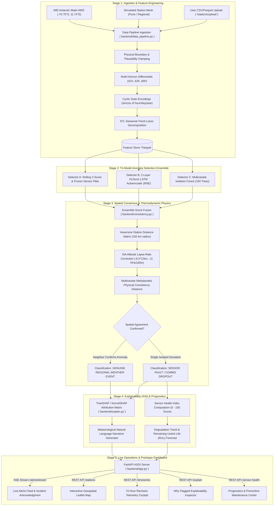
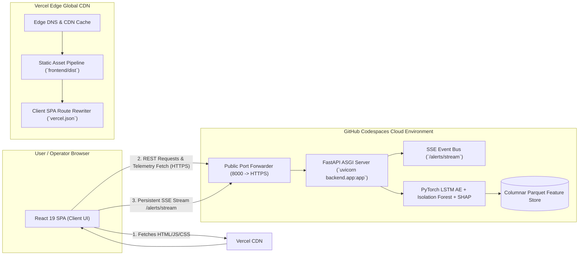

# 🛰️ SkyguardAI — Complete Technology Stack & System Architecture

> **Platform Overview**: SkyguardAI is an operational atmospheric anomaly detection, spatial consensus fusion, and sensor prognostics system designed for Automatic Weather Station (AWS) networks and extreme meteorological environments (including the Indian Meteorological Department Antarctic Maitri Station at -70.75°S, 11.74°E).

---

## 1. System Architecture Overview

```
+-----------------------------------------------------------------------------------------------------------------------+
|                                                SKYGUARDAI SYSTEM ARCHITECTURE                                         |
+=======================================================================================================================+
|  PRESENTATION LAYER      | React 19.2 | TypeScript 6.0 | Vite 8.2 | React-Leaflet 5.0 | Recharts 3.10 | Lucide React      |
|  DESIGN SYSTEM           | Vanilla CSS Glassmorphism Engine | CSS Variables | HTML5 Canvas Dynamic Gauges | Light/Dark Theme  |
|  STREAMING & REST APIS   | FastAPI 0.110 | Server-Sent Events (SSE-Starlette 2.0) | Pydantic v2.6 | Uvicorn ASGI Server   |
|  AI & ML ENSEMBLE        | PyTorch 2.2 (LSTM Autoencoder) | Scikit-Learn 1.4 (Isolation Forest) | SHAP 0.44 (XAI)         |
|  PHYSICS & STATS         | Statsmodels 0.14 (STL) | SciPy 1.12 (Mahalanobis Distance) | Altitude Lapse-Rate Normalization|
|  DATA & COLUMNAR STORAGE | Pandas 2.2 | NumPy 1.26 | Apache PyArrow 15.0 | Fastparquet | NetCDF4 / xarray (GRIB/NC)      |
|  HARDWARE & IOT EDGE     | Campbell CR1000X | RTD Pt100 Sensors | Piezoresistive Transducers | SDI-12 / RS-485 Modbus |
|  DEVOPS & CLOUD          | Vercel (Edge SPA CDN) | GitHub Codespaces (Cloud Backend) | Docker (Python 3.11) | Render | DevContainer |
|  TESTING & QUALITY       | Pytest 8.0+ | HTTPX Async Tests | Oxlint 1.79 | Smoke Test Suite | Healthcheck Endpoints        |
+-----------------------------------------------------------------------------------------------------------------------+
```

---

## 2. End-to-End Dataflow & Operational Methodology


```mermaid
flowchart TD
    subgraph STAGE1["Stage 1: Ingestion & Feature Engineering"]
        A1["IMD Antarctic Maitri AWS (-70.75°S, 11.74°E)"] --> B1["Data Pipeline Ingestion (`backend/data_pipeline.py`)"]
        A2["Simulated Station Mesh (Pune / Regional)"] --> B1
        A3["User CSV/Parquet Upload (`/stations/upload`)"] --> B1
        B1 --> B2["Physical Boundary & Plausibility Clamping"]
        B2 --> B3["Multi-Horizon Differentials (Δ1h, Δ3h, Δ6h)"]
        B3 --> B4["Cyclic Solar Encodings (sin/cos of hour/day/year)"]
        B4 --> B5["STL Seasonal-Trend Loess Decomposition"]
        B5 --> B6[("Feature Store: Parquet")]
    end

    subgraph STAGE2["Stage 2: Tri-Model Anomaly Detection Ensemble"]
        B6 --> M1["Detector A: Rolling Z-Score & Frozen Sensor Filter"]
        B6 --> M2["Detector B: 2-Layer PyTorch LSTM Autoencoder (MSE)"]
        B6 --> M3["Detector C: Multivariate Isolation Forest (150 Trees)"]
    end

    subgraph STAGE3["Stage 3: Spatial Consensus & Thermodynamic Physics"]
        M1 & M2 & M3 --> C1["Ensemble Score Fusion (`backend/consistency.py`)"]
        C1 --> C2["Haversine Station Distance Matrix (150 km radius)"]
        C2 --> C3["ISA Altitude Lapse-Rate Correction (-6.5°C/km, -11 hPa/100m)"]
        C3 --> C4["Multivariate Mahalanobis Physical Consistency Distance"]
        C4 --> C5{"Spatial Agreement Confirmed?"}
        C5 -- "Neighbor Confirms Anomaly" --> C6["Classification: GENUINE REGIONAL WEATHER EVENT"]
        C5 -- "Single Isolated Deviation" --> C7["Classification: SENSOR FAULT / COMMS DROPOUT"]
    end

    subgraph STAGE4["Stage 4: Explainability (XAI) & Prognostics"]
        C6 & C7 --> E1["TreeSHAP / KernelSHAP Attribution Matrix (`backend/explain.py`)"]
        E1 --> E2["Meteorological Natural Language Narrative Generator"]
        C7 --> E3["Sensor Health Index Computation (0 - 100 Score)"]
        E3 --> E4["Degradation Trend & Remaining Useful Life (RUL) Forecast"]
    end

    subgraph STAGE5["Stage 5: Live Operations & Prototype Dashboard"]
        E2 & E4 --> API["FastAPI ASGI Server (`backend/app.py`)"]
        API -->|SSE Stream /alerts/stream| UI1["Live Alerts Feed & Incident Acknowledgment"]
        API -->|REST API /stations| UI2["Interactive Geospatial Leaflet Map"]
        API -->|REST API /timeseries| UI3["72-Hour Recharts Telemetry Cockpit"]
        API -->|REST API /explain| UI4["Why Flagged Explainability Inspector"]
        API -->|REST API /sensor-health| UI5["Prognostics & Preventive Maintenance Center"]
    end
```

---

## 3. Technology Stack Breakdown by Layer

### 3.1 Client-Side Presentation Layer (Frontend)

| Technology | Exact Version | Architectural Purpose | Implementation Details |
| :--- | :--- | :--- | :--- |
| **React** | `19.2.8` | Declarative UI foundation | Uses React 19 concurrent rendering, state transitions, hooks (`useEffect`, `useState`, `useMemo`, `useCallback`) for real-time dashboards. |
| **TypeScript** | `~6.0.2` | Strongly typed contracts | Strict type definitions (`types.ts`) matching backend Pydantic models: `Alert`, `Station`, `SensorHealth`, `Explanation`, `TimeSeriesPoint`. |
| **Vite** | `8.2.2` | Development and production build bundler | Lightning-fast ESM dev server with sub-50ms HMR; optimized chunk splitting and asset pipeline. |
| **React Router DOM** | `6.22.0` | Client-side routing engine | Hash/Browser router coordinating 7 dedicated operational views with URL-driven deep-linking and state preservation. |
| **Leaflet** | `1.9.4` | Geospatial mapping library | High-performance interactive cartographic engine handling custom map layers, coordinate projections, and bounding boxes. |
| **React-Leaflet** | `5.0.0` | React wrapper for Leaflet | Declarative React components (`MapContainer`, `TileLayer`, `Marker`, `Popup`, `CircleMarker`) with CartoDB DarkMatter basemaps. |
| **Recharts** | `3.10.1` | SVG data visualization | Responsive timeseries charts, multi-series temperature/pressure/humidity overlays, synchronized tooltips, and SHAP horizontal bar charts. |
| **Lucide React** | `1.37.0` | Operational iconography | Scalable iconography for meteorology (`Thermometer`, `Gauge`, `Droplets`, `Wind`), status indicators (`AlertTriangle`, `CheckCircle2`), and hardware diagnostics. |
| **HTML5 Canvas Gauges** | Native Canvas API | Dynamic visual instrumentation | Custom hardware gauge (`ConfidenceGauge.tsx`) rendering smooth radial sweeps, glow effects, threshold ticks, and needle animations. |
| **Vanilla CSS Design System** | Modern CSS3 | Visual identity & styling | Deep space dark palette (`#070d18`, `#0f172a`), backdrop-filter glassmorphism, responsive CSS grid/flex layouts, CSS variables, and light/dark theme switching. |
| **Oxlint** | `1.79.0` | JavaScript/TypeScript linter | Ultra-fast Rust-based static code analysis checking for performance pitfalls and runtime antipatterns. |

#### Frontend Routes & Page Catalog

| Path / Route | View Component | Key Features |
| :--- | :--- | :--- |
| `/` | `LandingPage.tsx` | Platform introduction, mission overview, architecture preview, quick status metrics, and interactive launchpad. |
| `/#/live-alerts` | `LiveAlerts.tsx` | Real-time SSE alert stream receiver, severity filtering (`high`, `medium`, `low`), search, and operator acknowledgment flow. |
| `/#/stations/:id` | `StationDetail.tsx` | 72-hour high-resolution timeseries telemetry, multi-sensor synchronized Recharts, statistical summaries, and parameter threshold guides. |
| `/#/why-flagged/:alertId` | `WhyFlagged.tsx` | Explainable AI (XAI) cockpit, SHAP feature attributions, neighbor consensus delta tables, natural language domain narratives, and confidence gauges. |
| `/#/sensor-health/:id` | `SensorHealth.tsx` | Sensor Health Index (0-100), exponential degradation trend, Remaining Useful Life (RUL) estimation, and preventive maintenance triage. |
| `/#/network` | `NetworkOverview.tsx` | Full-screen Leaflet interactive network map, station cluster view, regional health heat-levels, and station detail drawers. |
| `/#/history` | `History.tsx` | Historical alert audit log, resolution tracking, root-cause categorization distribution, and CSV export capabilities. |

---

### 3.2 Server-Side Application & Streaming Layer (Backend)

| Technology | Exact Version | Architectural Purpose | Implementation Details |
| :--- | :--- | :--- | :--- |
| **Python** | `3.11+` | Backend runtime | Modern asynchronous execution environment with enhanced exception groups, faster startup times, and optimized vector operations. |
| **FastAPI** | `0.110.0+` | ASGI web framework | High-throughput asynchronous routing, automatic OpenAPI 3.1 & Swagger interactive docs (`/docs`), and request validation. |
| **Uvicorn (Standard)** | `0.28.0+` | Production ASGI web server | Powered by `uvloop` for high-concurrency event handling and `httptools` for fast HTTP parsing. |
| **SSE-Starlette** | `2.0.0+` | Server-Sent Events push engine | Implements `EventSource` protocol on `/alerts/stream` allowing real-time alert pushes to thousands of connected clients without client-side polling. |
| **Pydantic** | `2.6.0+` | Schema validation & serialization | Enforces strict domain contracts, serializing Enums (`Severity`, `RootCause`, `AlertStatus`, `Parameter`, `StationStatus`, `Trend`). |
| **HTTPX** | `0.27.0+` | Async HTTP client | Drives asynchronous integration test suites (`pytest tests/`) and connects to external meteorology and telemetry APIs. |
| **Python-Multipart** | `0.0.9+` | File upload parser | Powers multipart form-data handling on `/stations/upload` for uploading custom station CSV and Parquet telemetry files. |

---

### 3.3 Machine Learning, Statistical & Scientific Computing Stack

| Technology | Exact Version | Functional Role | Algorithmic Implementation |
| :--- | :--- | :--- | :--- |
| **PyTorch** | `2.2.0+` (CPU) | Deep learning sequence modeling | **LSTM Autoencoder** (`LSTMAutoencoder`): 2-layer sequence-to-sequence neural network ($64 \rightarrow 32 \rightarrow 64$ hidden units) trained on 24-step sliding windows. Anomalies are detected via reconstruction Mean Squared Error (MSE). |
| **Scikit-Learn** | `1.4.0+` | Unsupervised multivariate anomaly detection | **Isolation Forest** (`IsolationForestDetector`): 150 randomized isolation trees segmenting multidimensional sensor space; `StandardScaler` and `RobustScaler` for normalization. |
| **SHAP** | `0.44.0+` | Explainable AI (XAI) feature attribution | Computes exact Shapley values ($\phi_i$) for individual sensor readings, explaining the mathematical contribution of temperature, pressure, and humidity to the anomaly score. |
| **Statsmodels** | `0.14.0+` | Time-series decomposition | **STL (Seasonal-Trend Decomposition using LOESS)**: Separates 24-hour diurnal solar cycles from weather anomalies and high-frequency sensor noise. |
| **SciPy** | `1.12.0+` | Spatial and multivariate statistics | **Mahalanobis Distance** engine ($D_M$) using inverted covariance matrices ($\mathbf{\Sigma}^{-1}$) to detect coupled physical breakdowns between temperature, pressure, and humidity. |
| **NumPy** | `1.26.0+` | Vectorized numerical computation | High-speed array transformations, rolling differential calculations, matrix inversions, and trigonometric distance calculations. |
| **Pandas** | `2.2.0+` | Timeseries manipulation & feature engineering | High-performance rolling aggregations (6h/24h mean and standard deviation), timestamp alignment, and missing value interpolation. |
| **PyArrow & Fastparquet** | `15.0+` / `2024.2+` | Columnar storage format | Ultra-fast read/write operations for historical sensor records (`maitri_features.parquet`, `local_stations.parquet`), reducing disk footprints by >80%. |
| **netCDF4 & xarray** | `1.6.5+` / `2024.2+` | Scientific atmospheric format parsing | Ingestion and multi-dimensional coordinate slicing of NetCDF/GRIB climate records from global meteorological institutions. |

---

### 3.4 Hardware, Weather Station (AWS) & IoT Ingestion Stack

```
+----------------------------------------------------------------------------------------------------------------------+
|                                     HARDWARE TRANSDUCERS & IOT SPECIFICATIONS                                        |
+======================================================================================================================+
| SENSOR / HARDWARE       | TRANSDUCER TECHNOLOGY             | MEASUREMENT RANGE   | OPERATIONAL RESOLUTION / ACCURACY|
+-------------------------+-----------------------------------+---------------------+----------------------------------+
| Ambient Temperature     | Pt100 RTD 4-Wire Platinum         | -60°C to +50°C      | ±0.1°C (Class A 1/3 DIN)         |
| Barometric Pressure     | Piezoresistive Silicon Sensor     | 750 to 1080 hPa     | ±0.1 hPa (Temperature compensated|
| Relative Humidity       | Capacitive Thin-Film Polymer      | 0% to 100% RH       | ±1.5% RH (Non-condensing)        |
| Wind Speed & Direction  | 2D Ultrasonic Anemometer / Cup    | 0 to 200 knots      | ±1 knot / ±2° Azimuth            |
| Primary Datalogger      | Campbell Scientific CR1000X       | -40°C to +70°C      | 24-bit ADC, RS-485, SDI-12       |
| Edge Microcontroller    | Espressif ESP32-S3 / RPi CM4      | -40°C to +85°C      | Dual-core 240MHz, FreeRTOS, TinyML|
| Polar Telemetry Link    | Iridium SBD Satellite / 4G LTE-M  | Global (Antarctica) | 15-minute bursts / 1-minute alert|
+----------------------------------------------------------------------------------------------------------------------+
```

- **Physical Ground Truth**: Uses real observation telemetry from the **IMD Antarctic Maitri Station (-70.75°S, 11.74°E, 130m elevation)**, capturing blizzards, sensor freeze, katabatic winds, and extreme cold soak conditions.
- **Datalogger Protocols**: Ingestion pipeline supports SDI-12, RS-485 Modbus RTU, and analog current loops (4–20 mA).
- **Edge Deployment**: Pre-filtering algorithms (Z-score and frozen sensor checks) are structured for edge deployment on low-power ARM microcontrollers.

---

### 3.5 DevOps, Cloud Deployment & Infrastructure Topology

SkyguardAI utilizes a decoupled hybrid-cloud deployment model:
- **Frontend Presentation Layer**: Hosted on **Vercel** for worldwide low-latency edge caching, automatic branch previews, and Single Page Application (SPA) routing.
- **Backend & ML Inference Engine**: Deployed in **GitHub Codespaces** (or Docker/Render), providing a persistent cloud Linux compute environment with Python 3.11+, CPU-optimized PyTorch, and public port forwarding for REST and real-time SSE streaming.

```
+---------------------------------------------------------------------------------------------------------------------------------+
|                                                 CLOUD & DEPLOYMENT TOPOLOGY                                                     |
+=================================================================================================================================+
| ENVIRONMENT           | ROLE & WORKLOAD                    | CONFIGURATION FILE         | RUNTIME / PORT                        |
+-----------------------+------------------------------------+----------------------------+---------------------------------------+
| **Vercel**            | Client SPA Dashboard & Assets      | `vercel.json`              | Edge Network CDN / HTTPS              |
| **GitHub Codespaces** | Backend ASGI API & ML Pipelines    | `.devcontainer/devcontainer.json` | Cloud Linux / Port 8000 (Public HTTPS)|
| **Docker (Production)**| Multi-stage Containerized Backend  | `Dockerfile`               | Python 3.11-slim / Port 7860 (UID 1000)|
| **Docker Compose**    | Local Multi-container Stack        | `docker-compose.yml`       | Ports 8000:8000 (Backend API)         |
| **Hugging Face Spaces**| ML Demonstration Space            | `Dockerfile` (Spaces SDK)  | Port 7860 with /health probes         |
| **Render.com**        | Cloud PaaS Web Service             | `render.yaml`              | Python 3.11 Free Dyno ($PORT)         |
| **Local Development** | Dual-process Dev Environment       | `start.bat` / `start.sh`   | Ports 8000 (FastAPI) & 5173 (Vite)    |
+---------------------------------------------------------------------------------------------------------------------------------+
```

#### 3.5.1 Primary Cloud Deployment: Vercel + GitHub Codespaces Architecture


```mermaid
flowchart LR
    subgraph CLIENT["User / Operator Browser"]
        Browser["React 19 SPA (Client UI)"]
    end

    subgraph VERCEL["Vercel Edge Global CDN"]
        V1["Edge DNS & CDN Cache"]
        V2["Static Asset Pipeline (`frontend/dist`)"]
        V3["Client SPA Route Rewriter (`vercel.json`)"]
        V1 --> V2 --> V3
    end

    subgraph CODESPACES["GitHub Codespaces Cloud Environment"]
        CS_Port["Public Port Forwarder (8000 -> HTTPS)"]
        FastAPI_App["FastAPI ASGI Server (`uvicorn backend.app:app`)"]
        SSE_Engine["SSE Event Bus (`/alerts/stream`)"]
        ML_Ensemble["PyTorch LSTM AE + Isolation Forest + SHAP"]
        Parquet_Store[("Columnar Parquet Feature Store")]
        CS_Port --> FastAPI_App
        FastAPI_App --> SSE_Engine
        FastAPI_App --> ML_Ensemble
        ML_Ensemble --> Parquet_Store
    end

    Browser -- "1. Fetches HTML/JS/CSS" --> Vercel_CDN["Vercel CDN"]
    Vercel_CDN --> Browser
    Browser -- "2. REST Requests & Telemetry Fetch (HTTPS)" --> CS_Port
    Browser -- "3. Persistent SSE Stream /alerts/stream" --> CS_Port
```

- **Frontend on Vercel**:
  - **Single Page App Routing**: Managed through `vercel.json` with a rewrite rule sending all subpaths `/(.*)` to `/index.html`, ensuring seamless navigation across all 7 views (`/live-alerts`, `/stations/:id`, `/why-flagged/:alertId`, `/sensor-health/:id`, etc.) without 404s.
  - **Dynamic Backend Target**: Configured via Vite environment variable `VITE_API_BASE_URL` in `frontend/src/config.ts`, pointing to the active GitHub Codespaces forwarded URL:
    ```typescript
    export const API_BASE_URL = (import.meta.env.VITE_API_BASE_URL as string | undefined) || "http://localhost:8000";
    ```
  - **Zero-Config Build Pipeline**: Automatically triggers on Git push, running `cd frontend && npm install && npm run build` and outputting to `frontend/dist`.

- **Backend on GitHub Codespaces**:
  - **Cloud Compute Container**: Runs inside an automated development container defined by `.devcontainer/devcontainer.json` based on `mcr.microsoft.com/devcontainers/python:3.11` and Node.js 20.
  - **Public Port Forwarding**: Port `8000` is exposed with **public visibility**, generating an auto-secured HTTPS proxy endpoint (`https://<codespace-name>-8000.app.github.dev`) reachable by Vercel edge clients.
  - **CORS Configuration**: The FastAPI backend in `backend/app.py` features `allow_origin_regex=r".*"` and `allow_credentials=True`, permitting requests from any Vercel domain (`*.vercel.app`) and Codespaces preview URL without origin rejection.
  - **Server-Sent Events Over Cloud Proxy**: Streams live real-time anomalies through the GitHub Codespaces port proxy without buffer truncation or timeout drops.

---

## 4. Algorithmic Formulations & Mathematical Models

### 4.1 Multi-Model Anomaly Detection Ensemble

1. **Statistical Detector & Frozen Sensor Detection**:
   $$\mu_t = \frac{1}{K}\sum_{i=0}^{K-1} x_{t-i}, \quad \sigma_t = \sqrt{\frac{1}{K}\sum_{i=0}^{K-1}(x_{t-i} - \mu_t)^2}$$
   $$Z_t = \frac{|x_t - \mu_t|}{\sigma_t}$$
   $$\text{Anomaly Flag} \iff Z_t > 3.0 \quad \lor \quad \sigma_t < 10^{-4} \ (\text{for } K \ge 6)$$

2. **PyTorch LSTM Sequence Autoencoder**:
   - Encodes a 24-step sliding window $\mathbf{X} \in \mathbb{R}^{24 \times d}$ into a latent vector $\mathbf{h} \in \mathbb{R}^{32}$.
   - Decodes $\mathbf{h}$ back to reconstructed sequence $\hat{\mathbf{X}} \in \mathbb{R}^{24 \times d}$.
   - Computes reconstruction loss:
     $$\mathcal{L}_{\text{recon}} = \frac{1}{24 \cdot d} \sum_{t=1}^{24}\sum_{j=1}^d (x_{t,j} - \hat{x}_{t,j})^2$$

3. **Multivariate Isolation Forest**:
   - Evaluates path length $h(\mathbf{x})$ across 150 randomized decision trees to compute anomaly score $s(\mathbf{x}, n)$:
     $$s(\mathbf{x}, n) = 2^{-\frac{\mathbb{E}(h(\mathbf{x}))}{c(n)}}$$
     where $c(n) = 2\ln(n - 1) + 0.5772156649 - \frac{2(n-1)}{n}$ is the average path length of unsuccessful searches in a Binary Search Tree.

---

### 4.2 Spatial Consensus & Thermodynamic Validation Engine

To eliminate false alarms caused by genuine meteorological storm fronts:
1. **Haversine Distance Matrix**:
   $$d = 2R \arcsin \left(\sqrt{\sin^2\left(\frac{\Delta \phi}{2}\right) + \cos\phi_1\cos\phi_2\sin^2\left(\frac{\Delta \lambda}{2}\right)}\right)$$

2. **International Standard Atmosphere (ISA) Altitude Lapse Rates**:
   $$T_{\text{expected}} = T_{\text{neighbor}} - 0.0065 \cdot \Delta z \quad (^\circ\text{C})$$
   $$P_{\text{expected}} = P_{\text{neighbor}} - 0.11 \cdot \left(\frac{\Delta z}{100}\right) \quad (\text{hPa})$$

3. **Multivariate Mahalanobis Physical Consistency**:
   $$D_M(\mathbf{x}) = \sqrt{(\mathbf{x} - \boldsymbol{\mu})^T \mathbf{\Sigma}^{-1} (\mathbf{x} - \boldsymbol{\mu})}$$

4. **Tri-State Classification Logic**:
   - If station anomaly score is high **AND** neighboring stations within 150 km confirm similar deviations (accounting for lapse rates), classify as **`GENUINE_EVENT`**.
   - If station anomaly score is high **AND** neighbors report normal conditions, classify as **`SENSOR_FAULT`**.
   - If readings exhibit packet loss, repeated timestamps, or zero-bit patterns, classify as **`COMMS_ERROR`**.

---

### 4.3 Sensor Health Index & Prognostics Formula

The Sensor Health Index $H_t \in [0, 100]$ combines three degradation factors:
$$H_t = 100 - \left(w_d \cdot D_{\text{drift}} + w_f \cdot F_{\text{error}} + w_n \cdot N_{\text{noise}}\right)$$
- $D_{\text{drift}}$: Cumulative drift from expected spatial baseline.
- $F_{\text{error}}$: Rolling 7-day anomaly trigger frequency.
- $N_{\text{noise}}$: High-frequency signal variance ratio.

**Remaining Useful Life (RUL)** is forecast by fitting a linear degradation trend:
$$\text{RUL} = \max\left(0, \frac{H_t - H_{\text{failure}}}{\left|\frac{dH}{dt}\right|}\right) \quad \text{hours, where } H_{\text{failure}} = 40$$

---

## 5. Complete REST & SSE API Catalog

All 11 endpoints provided by `backend/app.py`:

| Method | Endpoint Path | Query / Body Parameters | Return Type | Functional Description |
| :--- | :--- | :--- | :--- | :--- |
| `GET` | `/health` | None | `JSON` | Returns system health, station count, active alerts count, and model load status. |
| `GET` | `/stations` | None | `List[Station]` | Returns metadata, geo-coordinates, elevation, status, and latest telemetry for all stations. |
| `DELETE` | `/stations/{station_id}` | `station_id: str` | `JSON` | Removes a registered weather station from the active monitoring mesh. |
| `POST` | `/stations/upload` | `file: UploadFile` | `JSON` | Ingests custom CSV/Parquet station telemetry datasets into the live feature pipeline. |
| `GET` | `/alerts` | `status`, `min_severity`, `limit` | `List[Alert]` | Retrieves filtered active or historical alerts with root-cause classifications and confidence. |
| `POST` | `/alerts/{alert_id}/acknowledge`| `alert_id: str` | `Alert` | Updates alert status from `active` to `acknowledged` with operator timestamp. |
| `GET` | `/stations/{station_id}/timeseries`| `hours: int = 72` | `List[TimeSeriesPoint]` | Retrieves 72-hour high-resolution timeseries for temperature, pressure, and humidity. |
| `GET` | `/sensor-health/{station_id}` | `station_id: str` | `SensorHealth` | Computes 0–100 Health Score, degradation trend (`stable`/`degrading`), and RUL forecast. |
| `GET` | `/explain/{alert_id}` | `alert_id: str` | `Explanation` | Returns SHAP feature attribution values ($\phi_i$), neighbor deltas, and natural language narrative. |
| `GET` | `/alerts/stream` | None | `text/event-stream` | Server-Sent Events (SSE) live push stream broadcasting newly generated alerts in real time. |
| `POST` | `/simulate/scenario` | `scenario: str`, `city: str` | `JSON` | Injects synthetic fault scenarios (`spike`, `frozen_sensor`, `genuine_event`, `drift`, `noise`, `drop`). |

---

## 6. Repository Layout & File Manifest

```
c:\SkyguardAI\
├── backend/
│   ├── __init__.py                # Backend package marker
│   ├── app.py                     # FastAPI application, 11 REST & SSE endpoints, CORS
│   ├── config.py                  # Pydantic Enums (Severity, RootCause, StationStatus, Parameter)
│   ├── consistency.py             # Spatial consensus, Haversine, lapse rate, Mahalanobis distance
│   ├── data_pipeline.py           # Ingestion, physical validation, rolling features, STL decomposition
│   ├── detectors.py               # Rolling Z-score, PyTorch LSTM Autoencoder, Isolation Forest
│   ├── explain.py                 # SHAP explainability engine, natural language generator, RUL
│   ├── simulate.py                # Synthetic station generation and 6 fault injection scenarios
│   ├── smoke_test.py              # Self-contained backend smoke test suite
│   └── requirements.txt           # Backend-specific Python dependencies
├── data/
│   ├── raw/                       # Raw IMD Maitri Station polar observations
│   └── processed/                 # Cleaned Parquet files and feature stores
├── frontend/
│   ├── src/
│   │   ├── components/            # Reusable UI components
│   │   │   ├── AddStationModal.tsx# Custom station upload and registration modal
│   │   │   ├── BrandLogo.tsx      # SVG vector brand logo with glowing radar sweeps
│   │   │   ├── ConfidenceGauge.tsx# Custom HTML5 dynamic Canvas radial gauge
│   │   │   ├── Navbar.tsx         # Responsive header navigation with live status badges
│   │   │   ├── SensorDeviationGraph.tsx # Comparative Recharts neighbor deviation chart
│   │   │   └── ThemeSwitcher.tsx  # Dynamic Dark / Light theme toggle
│   │   ├── pages/                 # Core operational views
│   │   │   ├── History.tsx        # Historical audit log and resolution review
│   │   │   ├── LandingPage.tsx    # High-impact platform landing page & interactive launchpad
│   │   │   ├── LiveAlerts.tsx     # Real-time SSE alert monitoring & triage
│   │   │   ├── NetworkOverview.tsx# Interactive Leaflet geospatial network map
│   │   │   ├── SensorHealth.tsx   # Prognostics, Health Score Index & RUL forecasting
│   │   │   ├── StationDetail.tsx  # 72-hour timeseries telemetry visualization
│   │   │   └── WhyFlagged.tsx     # XAI cockpit with SHAP attributions & domain narratives
│   │   ├── api.ts                 # Typed fetch client and SSE EventSource listener
│   │   ├── App.tsx                # React Router DOM configuration
│   │   ├── config.ts              # API base URL and environment bindings
│   │   ├── index.css              # Custom Glassmorphism design system & CSS variables
│   │   ├── main.tsx               # React application entrypoint
│   │   ├── mockData.ts            # High-fidelity offline fallback data for resilient demos
│   │   └── types.ts               # TypeScript interfaces matching backend models
│   ├── package.json               # Frontend dependencies & scripts
│   ├── tsconfig.json              # TypeScript compiler configuration
│   └── vite.config.ts             # Vite configuration with React plugin
├── tests/
│   └── test_api.py                # Automated Pytest suite for API and ML models
├── Dockerfile                     # Multi-stage production container (Hugging Face Spaces ready)
├── docker-compose.yml             # Local multi-service orchestration
├── render.yaml                    # Render.com cloud deployment configuration
├── vercel.json                    # Vercel SPA routing and deployment manifest
├── requirements.txt               # Root Python dependencies
├── start.bat / start.sh           # One-click startup scripts for Windows and POSIX systems
├── stop.bat                       # Clean process termination script for Windows
├── PRD.md                         # Product Requirements Document
├── FRONTEND_ARCHITECTURE.md       # Frontend UI architecture and design specs
└── TECHSTACK.md                   # This document
```

---

### 7.1 Cloud Deployment: Vercel (Frontend) + GitHub Codespaces (Backend)

SkyguardAI can be run completely in the cloud with zero local setup:

#### Step 1: Start Backend in GitHub Codespaces
1. Open the repository in **GitHub Codespaces** (`Code` button $\rightarrow$ `Codespaces` $\rightarrow$ `Create codespace on main`).
2. The `.devcontainer/devcontainer.json` configuration will automatically provision Python 3.11, Node.js 20, install all backend requirements, and set port attributes.
3. Start the FastAPI ASGI server:
   ```bash
   uvicorn backend.app:app --host 0.0.0.0 --port 8000 --reload
   ```
4. In the **Ports** panel of VS Code / Codespaces:
   - Locate port `8000`.
   - Right-click port `8000` $\rightarrow$ **Port Visibility** $\rightarrow$ Change to **Public**.
   - Copy the forwarded HTTPS address (e.g., `https://<codespace-id>-8000.app.github.dev`).

#### Step 2: Deploy Frontend on Vercel
1. Import the repository into your **Vercel Dashboard**.
2. Vercel automatically detects `vercel.json`:
   - **Framework Preset**: Vite
   - **Build Command**: `cd frontend && npm install && npm run build`
   - **Output Directory**: `frontend/dist`
3. Add the Environment Variable in Vercel Project Settings:
   - `VITE_API_BASE_URL` = `https://<codespace-id>-8000.app.github.dev`
4. Deploy. The live Vercel URL (e.g., `https://skyguard-ai.vercel.app`) now communicates with your Codespaces cloud backend over secure HTTPS and live SSE.

---

### 7.2 Local Native Execution

```bash
# 1. Activate Python virtual environment & install requirements
.venv\Scripts\activate
pip install -r requirements.txt

# 2. Launch FastAPI backend server
uvicorn backend.app:app --host 0.0.0.0 --port 8000 --reload

# 3. Launch Vite frontend development server (in a separate terminal)
cd frontend
npm install
npm run dev
```
- Open `http://localhost:5173` for the Operations Dashboard.
- Open `http://localhost:8000/docs` for the interactive OpenAPI/Swagger interface.

### 7.3 Containerized Execution (Docker)

```bash
# Build and start containerized backend
docker-compose up --build -d

# Verify container healthcheck status
docker ps
```

### 7.3 Synthetic Fault Injection Testing

Test the real-time detection, spatial consensus, and XAI pipeline using curl:

```bash
# Inject sudden temperature spike fault
curl -X POST "http://localhost:8000/simulate/scenario?scenario=spike&city=pune"

# Inject frozen sensor anomaly (zero variance)
curl -X POST "http://localhost:8000/simulate/scenario?scenario=frozen_sensor&city=pune"

# Inject genuine regional weather event (multi-station spatial confirmation)
curl -X POST "http://localhost:8000/simulate/scenario?scenario=genuine_event&city=pune"

# Inject gradual calibration drift
curl -X POST "http://localhost:8000/simulate/scenario?scenario=drift&city=pune"

# Inject high-frequency transducer noise
curl -X POST "http://localhost:8000/simulate/scenario?scenario=noise&city=pune"
```

### 7.4 Automated Quality & Regression Testing

```bash
# Run complete test suite with coverage
pytest tests/ -v

# Run frontend linting check
cd frontend && npm run lint
```

---

## 8. Summary Matrix

| Evaluation Dimension | SkyguardAI Implementation Standard |
| :--- | :--- |
| **Primary Programming Languages** | Python `3.11+` (Backend & AI) \| TypeScript `6.0+` (Client Dashboard) |
| **Core Web Frameworks** | FastAPI `0.110+` (ASGI) \| React `19.2.8` \| Vite `8.2.2` |
| **Real-Time Data Delivery** | Server-Sent Events (SSE) via SSE-Starlette (`/alerts/stream`) |
| **Machine Learning Suite** | PyTorch `2.2+` (LSTM Autoencoder) \| Scikit-Learn `1.4+` (Isolation Forest) |
| **Spatial Consensus Engine** | Haversine Matrix (150 km) \| ISA Lapse-Rates (-6.5°C/km, -11 hPa/100m) \| Mahalanobis $D_M$ |
| **Explainable AI (XAI)** | SHAP Feature Attributions ($\phi_i$) \| Meteorological Domain Natural Language Engine |
| **Prognostic Intelligence** | 0–100 Health Score Index \| Degradation Slope \| Remaining Useful Life (RUL) Forecast |
| **Geospatial & Timeseries UI** | Leaflet `1.9.4` + CartoDB Dark \| Recharts `3.10.1` \| HTML5 Dynamic Canvas Gauges |
| **Data Storage Standard** | Apache Parquet 2.0 (PyArrow) \| NetCDF4 / xarray \| In-Memory Caching |
| **Cloud & DevOps Ready** | Vercel (Edge SPA CDN) \| GitHub Codespaces (Cloud Backend) \| Docker \| Render.com \| Hugging Face Spaces |
